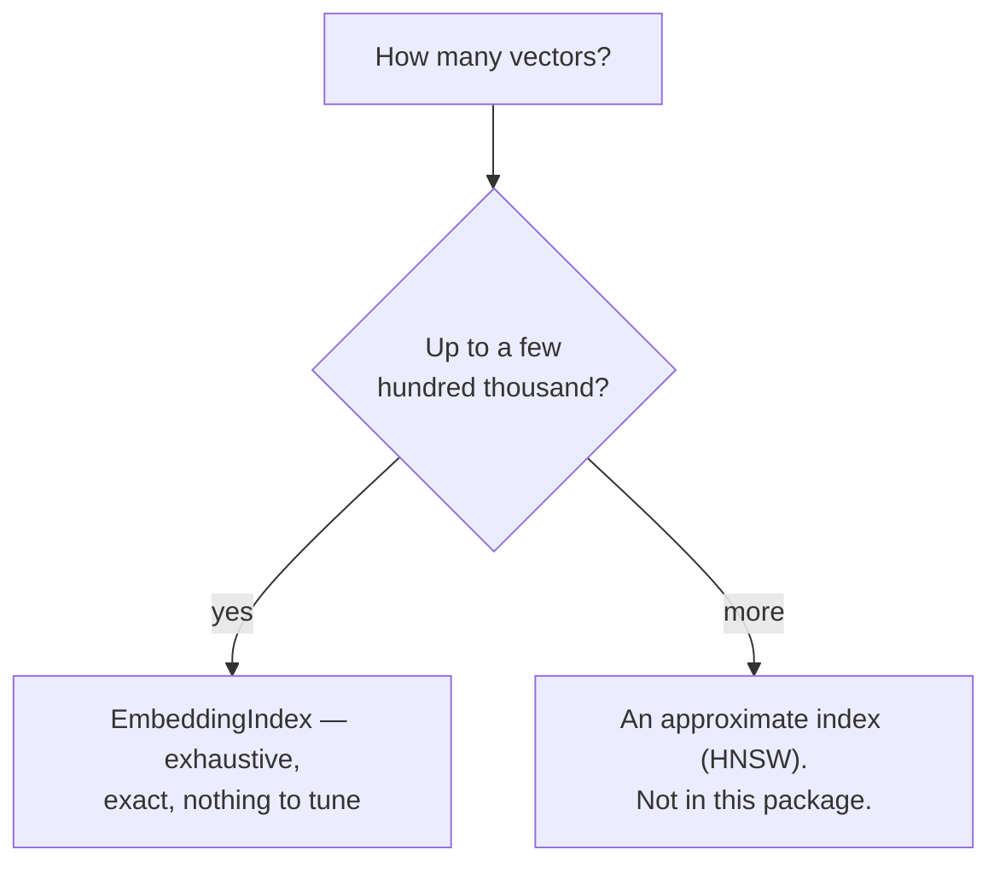

# Vector search — `Lodestar.Embeddings.Search`

Embedding a corpus is the expensive half and it happens once. What comes after is cheap and
constant: given a query vector, which of the stored vectors point most nearly the same way.

`Lodestar.Embeddings.Search` answers that with an **exhaustive** index — every stored vector is
scored on every query — plus the two SIMD primitives it is built on.

## Why exhaustive, and when it stops being right



Scoring every vector is linear, and a SIMD dot product makes the constant small enough that the
crossover with an approximate index sits far higher than most corpora ever reach. The trade the
approximate structures make — recall for speed, plus parameters to tune and a graph to build — is
not worth taking before the linear scan is actually the bottleneck.

The consequence is that [`EmbeddingIndex.Search`](search/embeddingindex-search.md) is **exact**.
There is no recall parameter, because nothing is skipped.

## Cosine, reduced to a dot product

An index normalizes on insertion by default, and normalizes the query too. Once both sides are
unit vectors, cosine similarity *is* the dot product — so the hot loop is
[`VectorMath.Dot`](search/vectormath-dot.md) and nothing else.

```csharp
using Lodestar.Embeddings.Search;

var index = new EmbeddingIndex(dimension: 2);
index.Add(new float[] { 1f, 0f });
index.Add(new float[] { 0f, 1f });

IReadOnlyList<SearchResult> hits = index.Search(new float[] { 2f, 0f }, k: 1);
int best = hits[0].Index;  // => 0
float score = hits[0].Score;  // => 1
```

The query was `(2, 0)` and the score is `1`: length was normalized away on both sides, which is
the point of cosine and the reason a query need not be scaled by the caller.

## What comes back, and how to get from it to a document

[`Search`](search/embeddingindex-search.md) returns
[`SearchResult`](search/searchresult.md) — a position and a score, and deliberately not your
document. The id is fetched separately with [`GetId`](search/embeddingindex-getid.md), so the
scored array stays a block of 8-byte structs the garbage collector never has to look inside.

## Saving the expensive half

[`Save`](search/embeddingindex-save.md) writes the index and
[`Load`](search/embeddingindex-load.md) reads it back, vectors restored bit for bit rather than
re-normalized. Two things about that file are worth knowing before relying on it:

- **The normalization flag travels in the file** and cannot be supplied on load. An index reloaded
  under the other setting would rank a corpus wrongly and never look wrong.
- **A vector holding `NaN` or an infinity can be added but cannot be saved.** The refusal is
  deliberate — [`Add`](search/embeddingindex-add.md) has the reasoning.

## Types

| Type | What it is |
| --- | --- |
| [`EmbeddingIndex`](search/embeddingindex.md) | The exhaustive cosine index: add, search, save, load. |
| [`SearchResult`](search/searchresult.md) | One hit — a position and a score. |
| [`VectorMath`](search/vectormath.md) | The two SIMD primitives the index is built on. |

## See also

- [Embeddings, end to end](../../guides/embeddings.md) — "Index a corpus and query it".
- [Python → C# equivalence](../../equivalence.md) — what this replaces on the numpy and faiss side.
