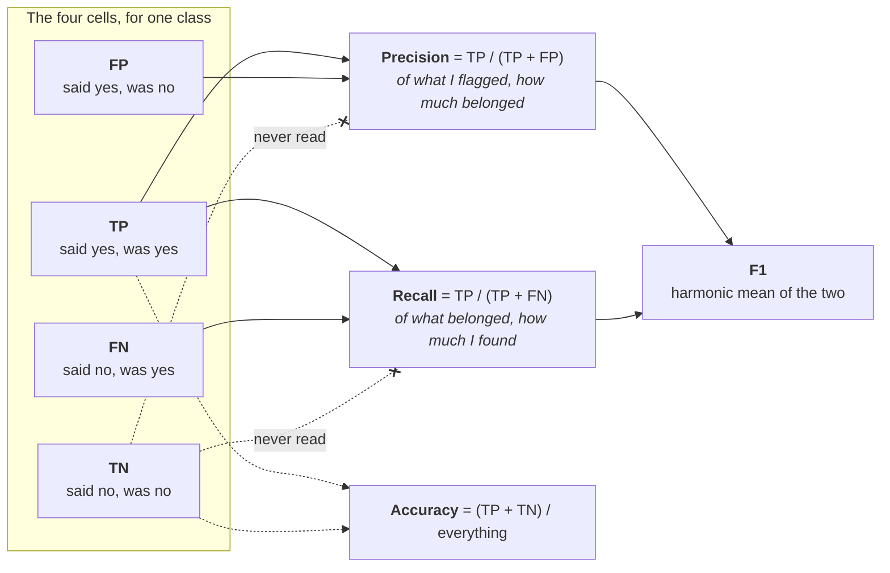
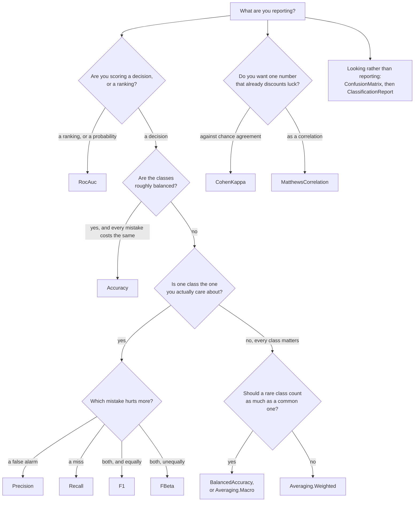

# Classification metrics — `Lodestar.Metrics`

Your model looked at some things and put a label on each one. How well did it do? Every type on this
page answers that, and they disagree — not about the arithmetic, but about what "well" is worth
measuring. One number can hide a model that never predicts the rare class; another can be near zero
for a model that is right nine times in ten. Reporting the wrong one is the usual reason a model
looks fine on a slide and useless in production.

Almost everything here is built on one object, so it is worth reading first.

A **confusion matrix** is a table with one row per true class and one column per predicted class,
and each cell holds how many samples fell there. The diagonal is what the model got right; every
other cell is a specific mistake — "this class, mistaken for that one". For two classes the table
has four cells, and they have names: **true positives** (said yes, was yes), **false positives**
(said yes, was no), **false negatives** (said no, was yes) and **true negatives** (said no, was no).
Precision, recall and F1 are three different divisions of those four numbers.

The dotted lines are the point: **`TN` is invisible to precision, recall and F1.** A model that says
"no" to everything scores perfectly on the true-negative cell and zero on all three of them, which
is why a rare-disease detector can be 99% accurate and worthless.

Three conventions run through the whole namespace.

- **Every metric has two ways in.** One overload takes `yTrue` and `yPred` and counts the matrix on
  the way; the other takes a `ConfusionMatrix` you already have. They give the same number, and the
  second is what you want when you are reporting five metrics over one dataset — the counting
  happens once. The one place they can differ is an explicit `labels` subset, and each entry says so.
- **Labels are `int`.** A `string` class name is the caller's mapping to make, and
  `ClassificationReport`'s `targetNames` is where readable names go back on.
- **Undefined is a real answer, not a crash.** A class nothing was predicted into has no precision;
  a class with no true samples has no recall. `ZeroDivision` says what comes back, and the default
  reproduces scikit-learn's `0.0`.

Regression metrics — how far a number is from another number — are on the
[regression page](regression.md), not here.

## Which one do I report?

## Two of them ask about the confidence, not the answer

[`Accuracy`](classification/accuracy.md) and its relatives ask whether the prediction was right, and
[`RocAuc`](classification/rocauc.md) asks whether the ranking was. [`LogLoss`](classification/logloss.md)
and [`BrierScore`](classification/brierscore.md) ask whether the *confidence* was honest, which is
the question worth asking before a threshold is chosen — a model can be accurate and badly
calibrated at once, and neither of the first two would say so.

Both are proper scoring rules, so neither can be gamed by shading a probability toward the safer
answer. They disagree only about how much one overconfident sample should matter: a probability of
`0` for a class that occurred costs at most `1` on the Brier score and about `36` on the log loss,
which is where its clip lands.

| Type | What it is |
| --- | --- |
| [`Accuracy`](classification/accuracy.md) | The share of samples the model got right. |
| [`Auc`](classification/auc.md) | The area under a curve you already have, by the trapezoidal rule. |
| [`AverageRow`](classification/averagerow.md) | One averaged line of a `ClassificationReport`. |
| [`BinStrategy`](classification/binstrategy.md) | Where a calibration curve gets its bin edges. |
| [`Averaging`](classification/averaging.md) | How per-class scores are reduced to one number. |
| [`BalancedAccuracy`](classification/balancedaccuracy.md) | Accuracy that counts every class equally, however rare. |
| [`BrierScore`](classification/brierscore.md) | The mean squared error of a probabilistic prediction — a confident mistake costs at most 1. |
| [`ClassificationReport`](classification/classificationreport.md) | The per-class table, structured and as printable text. |
| [`ClassRow`](classification/classrow.md) | One class's line of a `ClassificationReport`. |
| [`CohenKappa`](classification/cohenkappa.md) | Agreement between two raters, with chance agreement subtracted. |
| [`ConfusionMatrix`](classification/confusionmatrix.md) | Predictions counted against truth — the table everything else reads. |
| [`DetCurve`](classification/detcurve.md) | The detection error tradeoff curve as plot data — both axes are errors. |
| [`F1`](classification/f1.md) | The harmonic mean of precision and recall. |
| [`FBeta`](classification/fbeta.md) | The same, with the balance between the two turned by hand. |
| [`HammingLoss`](classification/hammingloss.md) | The share of labels predicted wrongly — on a matrix, labels rather than samples. |
| [`JaccardScore`](classification/jaccardscore.md) | Intersection over union, the strictest of the three ratios precision and recall sit either side of. |
| [`KappaWeighting`](classification/kappaweighting.md) | How far apart two classes count as being, for `CohenKappa`. |
| [`LogLoss`](classification/logloss.md) | The cross-entropy of a probabilistic prediction — unbounded, and dominated by one confident mistake. |
| [`MatthewsCorrelation`](classification/matthewscorrelation.md) | The correlation between prediction and truth, in `[-1, 1]`. |
| [`MultiClassRocOptions`](classification/multiclassrocoptions.md) | The optional settings of multiclass ROC-AUC. |
| [`MultiClassStrategy`](classification/multiclassstrategy.md) | One class against the rest, or every pair. |
| [`MultilabelConfusionMatrix`](classification/multilabelconfusionmatrix.md) | One 2×2 matrix per label, or per sample — a stack of `ConfusionMatrix`, not a new type. |
| [`Normalization`](classification/normalization.md) | Which sum a confusion matrix's cells are divided by. |
| [`Precision`](classification/precision.md) | Of everything flagged as a class, how much belonged there. |
| [`CalibrationCurve`](classification/calibrationcurve.md) | The reliability curve as plot data; its arrays are as long as the bins that held something. |
| [`PrecisionRecallCurve`](classification/precisionrecallcurve.md) | The precision-recall curve as plot data; its thresholds array is one shorter. |
| [`Recall`](classification/recall.md) | Of everything that belonged to a class, how much was found. |
| [`RocAuc`](classification/rocauc.md) | How well the scores rank a positive above a negative. |
| [`RocCurve`](classification/roccurve.md) | The ROC curve as plot data, where `RocAuc` gives only its area. |
| [`UndefinedMetricException`](classification/undefinedmetricexception.md) | Thrown when a metric is undefined and you asked to be told. |
| [`ZeroDivision`](classification/zerodivision.md) | What an undefined metric returns instead of throwing. |
| [`ZeroOneLoss`](classification/zerooneloss.md) | The share of samples predicted wrongly — on a matrix, a row is wrong if any label is. |
