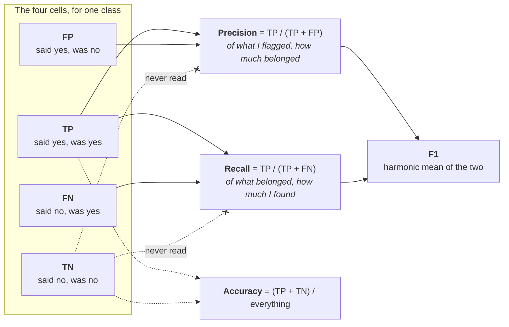
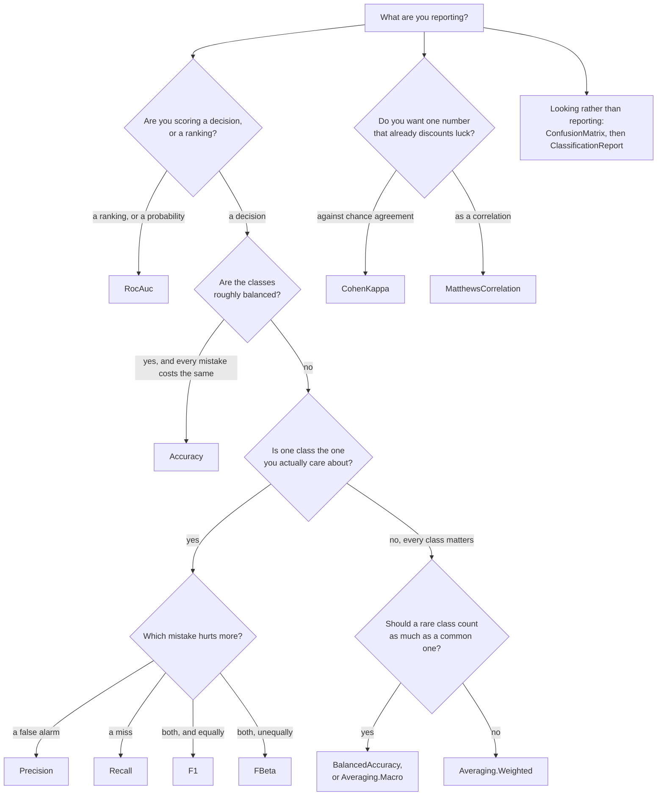

# Classification metrics — `DataNet.Metrics`

Your model looked at some things and put a label on each one. How well did it do? Every type on this
page answers that, and they disagree — not about the arithmetic, but about what "well" is worth
measuring. One number can hide a model that never predicts the rare class; another can be near zero
for a model that is right nine times in ten. Reporting the wrong one is the usual reason a model
looks fine on a slide and useless in production.

Almost everything here is built on one object, so it is worth reading first.

A **confusion matrix** is a table with one row per true class and one column per predicted class,
and each cell holds how many samples fell there. The diagonal is what the model got right; every
other cell is a specific mistake — "this class, mistaken for that one". For two classes the table
has four cells, and they have names: **true positives** (said yes, was yes), **false positives**
(said yes, was no), **false negatives** (said no, was yes) and **true negatives** (said no, was no).
Precision, recall and F1 are three different divisions of those four numbers.



The dotted lines are the point: **`TN` is invisible to precision, recall and F1.** A model that says
"no" to everything scores perfectly on the true-negative cell and zero on all three of them, which
is why a rare-disease detector can be 99% accurate and worthless.

Three conventions run through the whole namespace.

- **Every metric has two ways in.** One overload takes `yTrue` and `yPred` and counts the matrix on
  the way; the other takes a `ConfusionMatrix` you already have. They give the same number, and the
  second is what you want when you are reporting five metrics over one dataset — the counting
  happens once. The one place they can differ is an explicit `labels` subset, and each entry says so.
- **Labels are `int`.** A `string` class name is the caller's mapping to make, and
  `ClassificationReport`'s `targetNames` is where readable names go back on.
- **Undefined is a real answer, not a crash.** A class nothing was predicted into has no precision;
  a class with no true samples has no recall. `ZeroDivision` says what comes back, and the default
  reproduces scikit-learn's `0.0`.

Regression metrics — how far a number is from another number — are on the
[regression page](regression.md), not here.

## Which one do I report?



| Type | What it is |
| --- | --- |
| [`Accuracy`](#accuracy) | The share of samples the model got right. |
| [`AverageRow`](#averagerow) | One averaged line of a `ClassificationReport`. |
| [`Averaging`](#averaging) | How per-class scores are reduced to one number. |
| [`BalancedAccuracy`](#balancedaccuracy) | Accuracy that counts every class equally, however rare. |
| [`ClassificationReport`](#classificationreport) | The per-class table, structured and as printable text. |
| [`ClassRow`](#classrow) | One class's line of a `ClassificationReport`. |
| [`CohenKappa`](#cohenkappa) | Agreement between two raters, with chance agreement subtracted. |
| [`ConfusionMatrix`](#confusionmatrix) | Predictions counted against truth — the table everything else reads. |
| [`F1`](#f1) | The harmonic mean of precision and recall. |
| [`FBeta`](#fbeta) | The same, with the balance between the two turned by hand. |
| [`KappaWeighting`](#kappaweighting) | How far apart two classes count as being, for `CohenKappa`. |
| [`MatthewsCorrelation`](#matthewscorrelation) | The correlation between prediction and truth, in `[-1, 1]`. |
| [`MultiClassRocOptions`](#multiclassrocoptions) | The optional settings of multiclass ROC-AUC. |
| [`MultiClassStrategy`](#multiclassstrategy) | One class against the rest, or every pair. |
| [`Normalization`](#normalization) | Which sum a confusion matrix's cells are divided by. |
| [`Precision`](#precision) | Of everything flagged as a class, how much belonged there. |
| [`Recall`](#recall) | Of everything that belonged to a class, how much was found. |
| [`RocAuc`](#rocauc) | How well the scores rank a positive above a negative. |
| [`UndefinedMetricException`](#undefinedmetricexception) | Thrown when a metric is undefined and you asked to be told. |
| [`ZeroDivision`](#zerodivision) | What an undefined metric returns instead of throwing. |

## Reference

### Accuracy

The first number anyone asks for, and the one that misleads most often on unbalanced data.

#### Accuracy.Score

The share of samples whose predicted label equals the true one.

<!-- docs-declaration -->

```csharp
public static double Score(ReadOnlySpan<int> yTrue, ReadOnlySpan<int> yPred, bool normalize = true, ReadOnlySpan<double> sampleWeight = default)
public static double Score(ConfusionMatrix cm, bool normalize = true)
```

**Parameters** — `yTrue` and `yPred` are the true and predicted labels, one per sample and the same
length. `cm` is the alternative to both: a matrix already counted, which is what you pass when
several metrics are being read off one dataset. `normalize` chooses between the fraction (`true`,
the default) and the raw weight of the correct samples (`false`). `sampleWeight` gives each sample
its own weight; omit it and every sample counts 1.

**Returns** — `double` in `[0, 1]` when `normalize` is `true`, `1` meaning every sample was right.
With `normalize: false` it is a count instead — a weight, not a fraction, and unbounded.

**Exceptions** — `ArgumentException` when the two label spans disagree in length or are empty;
`ArgumentNullException` when `cm` is null.

**Example** — four spam messages and four legitimate ones; the filter caught two of the four and
raised one false alarm.

```csharp
using DataNet.Metrics;

int[] yTrue = [1, 1, 1, 1, 0, 0, 0, 0];
int[] yPred = [1, 1, 0, 0, 1, 0, 0, 0];

double share = Accuracy.Score(yTrue, yPred);   // => 0.625
```

**Remarks** — this is the right metric when the classes are roughly balanced and every mistake costs
about the same. Both conditions matter, and the first one is where people get hurt.

The trap has a number attached. Take ten samples of which two belong to the class you care about,
predict the majority class for all ten, and this returns `0.8` while
`BalancedAccuracy.Score` returns `0.5` — the score a coin gets. Accuracy is a weighted average of
the per-class recalls in which each class is weighted by how common it is, so a class that is 2% of
the data moves it by at most 0.02. If your positive class is rare, this number is measuring the
negative class and telling you about it.

The `ConfusionMatrix` overload has one behaviour of its own worth knowing. It is accuracy over the
samples the matrix **kept**: a matrix built with an explicit `labels` subset drops every sample
whose true or predicted label falls outside that subset, so on a three-class problem restricted to
two labels this can read `0.75` where the same data scored over every sample reads `0.7142…`. That
is not a bug in either number — they are answers to different questions — but only the span
overload matches `accuracy_score`.

**Applies to** — net10.0, netstandard2.0.

**See also** — `BalancedAccuracy.Score`, `ConfusionMatrix.Compute`, `ClassificationReport.Compute`,
the [Python equivalence table](../../equivalence.md).

### AverageRow

One averaged line of a report: `macro avg`, `weighted avg` or `micro avg`, with the same four
columns a class row has.

<!-- docs-declaration -->

```csharp
public sealed record AverageRow(string Name, double Precision, double Recall, double F1, double Support)
```

**Properties** — `Name` is the label scikit-learn prints for the row. `Precision`, `Recall` and `F1`
are the averaged scores, reduced the way the row's name says. `Support` is the total weight the
average covers, which is the same for all three rows of one report.

**Example** — the macro row of the three-class report below.

```csharp
using DataNet.Metrics;

int[] yTrue = [0, 0, 1, 1, 2, 2, 2];
int[] yPred = [0, 1, 1, 1, 2, 2, 0];

ClassificationReport report = ClassificationReport.Compute(yTrue, yPred);
AverageRow macro = report.MacroAverage;
double f1 = macro.F1;         // => 0.7000…
double support = macro.Support;   // => 7
```

**Remarks** — a record, so it is compared by value and prints its own contents, which makes it
useful in a test assertion without any ceremony. The three rows a report can hold are
`MacroAverage`, `WeightedAverage` and — only when an explicit label subset dropped samples —
`MicroAverage`.

The trap is `Support` on this row versus on a `ClassRow`. A class row's support is that class's own
weight; every average row carries the **total**, so summing the supports of a report's rows double
counts. Read `TotalSupport` off the report if that is what you want.

**Applies to** — net10.0, netstandard2.0.

**See also** — `ClassificationReport.Compute`, the [Python equivalence table](../../equivalence.md).

### Averaging

A per-class metric gives one number per class. This says how those numbers become one.

<!-- docs-declaration -->

```csharp
public enum Averaging { Binary, Micro, Macro, Weighted }
```

**Members** — `Binary` reports the positive class only, and is the default because it is
scikit-learn's; it is valid only when there are two classes. `Micro` pools the true positives,
false positives and false negatives over every class and divides once. `Macro` takes the plain
unweighted mean of the per-class scores. `Weighted` takes the mean weighted by each class's support.

**Example** — the same predictions read three ways.

```csharp
using DataNet.Metrics;

int[] yTrue = [0, 0, 1, 1, 2, 2, 2];
int[] yPred = [0, 1, 1, 1, 2, 2, 0];

double macro = Precision.Score(yTrue, yPred, Averaging.Macro);         // => 0.7222…
double weighted = Precision.Score(yTrue, yPred, Averaging.Weighted);   // => 0.7619…
double micro = Precision.Score(yTrue, yPred, Averaging.Micro);         // => 0.7142…
```

**Remarks** — the choice between `Macro` and `Weighted` is a choice about what a class is worth.
`Macro` says every class counts once, so a class with three samples moves the score as much as one
with three thousand — which is what you want when the rare classes are the interesting ones, and
misleading when they are noise. `Weighted` says every *sample* counts once, which keeps the score
close to what a user experiences and lets a rare class be ignored entirely.

`Micro` is the odd one. Pooling the counts before dividing makes micro-precision, micro-recall and
micro-F1 all equal to each other and, when every class is included, all equal to accuracy — the
`0.7142…` above is exactly `Accuracy.Score` on the same data. It is worth computing only when an
explicit label subset has left some samples out, which is the case it exists for.

Two traps. `Binary` is the **default**, so a call written for two classes and later fed three throws
rather than silently averaging; that is deliberate, and the fix is to name the averaging you meant.
And scikit-learn's `average=None` has no member here: it changes the return type rather than the
value, so it is a separate method — `Precision.PerClass` and its siblings.

**Applies to** — net10.0, netstandard2.0.

**See also** — `Precision.Score`, `Precision.PerClass`, `BalancedAccuracy.Score`,
the [Python equivalence table](../../equivalence.md).

### BalancedAccuracy

Accuracy with the class sizes divided out: the average of the per-class recalls.

#### BalancedAccuracy.Score

The mean recall over the classes that have at least one true sample.

<!-- docs-declaration -->

```csharp
public static double Score(ConfusionMatrix cm, bool adjusted = false)
public static double Score(ReadOnlySpan<int> yTrue, ReadOnlySpan<int> yPred, bool adjusted = false, ReadOnlySpan<int> labels = default, ReadOnlySpan<double> sampleWeight = default)
```

**Parameters** — `cm` is a matrix already counted, or pass `yTrue` and `yPred` and let it be counted
here. `adjusted` rescales the result so that chance scores `0` instead of `1/k`. `labels` fixes the
label set and its order; omit it for the sorted union of both inputs. `sampleWeight` gives each
sample its own weight.

**Returns** — `double` in `[0, 1]` normally, `1` meaning every class was recalled perfectly. With
`adjusted: true` the range becomes `[-1/(k-1) … 1]`, so a below-chance model returns a negative
number.

**Exceptions** — `ArgumentException` when the label spans disagree in length or are empty;
`ArgumentNullException` when `cm` is null.

**Example** — ten samples, two of them positive, and a model that predicts the majority class every
time. `Accuracy.Score` on this data is `0.8`.

```csharp
using DataNet.Metrics;

int[] yTrue = [0, 0, 0, 0, 0, 0, 0, 0, 1, 1];
int[] yPred = [0, 0, 0, 0, 0, 0, 0, 0, 0, 0];

double balanced = BalancedAccuracy.Score(yTrue, yPred);   // => 0.5
```

**Remarks** — reach for this the moment the classes are unbalanced and you still want one number. It
is the honest version of accuracy for that case: a model that ignores the minority class cannot get
above `0.5` on two classes however large the majority is, because each class contributes its own
recall and nothing else. On more than two classes it is exactly macro-averaged recall, so
`BalancedAccuracy.Score` and `Recall.Score(…, Averaging.Macro)` are two names for one number when no
label subset is in play.

`adjusted: true` answers a different complaint: that `0.5` on two classes and `0.333…` on three both
mean "no better than guessing", and cannot be compared. Adjusting maps chance to `0` and perfect to
`1` whatever `k` is, at the price of a range that now goes negative.

Two traps, and the second is subtle. The average runs over the classes that **appear in the truth**,
not the classes you asked for — a class named in `labels` with no true sample is dropped rather than
scored `0`, which is scikit-learn's behaviour and means the divisor is not always `labels.Length`.
And when only one class survives that filter, `adjusted: true` divides by `1 - 1/1`, so the result
is `NaN` or `-∞` rather than a number; that is left to IEEE 754 on purpose, and the reasoning is in
[decision 0029](../../decisions/0029-balanced-accuracy-adjusted-is-left-to-ieee-754-at-the-edge.md).

The `ConfusionMatrix` overload divides each recall by its own row sum in the `Labels`-sized view,
where `Recall.Score` divides by scikit-learn's `true_sum` over every observed label. The two agree
whenever nothing was dropped, and part company on a matrix built with an explicit label subset.

**Applies to** — net10.0, netstandard2.0.

**See also** — `Accuracy.Score`, `Recall.Score`, `CohenKappa.Score`,
[decision 0029](../../decisions/0029-balanced-accuracy-adjusted-is-left-to-ieee-754-at-the-edge.md),
the [Python equivalence table](../../equivalence.md).

### ClassificationReport

The table people actually paste into a pull request: precision, recall, F1 and support, per class,
plus the averages — available both as objects and as scikit-learn's own text, character for
character.

#### ClassificationReport.Compute

Builds the report: one row per class, the accuracy, and two or three averaged rows.

<!-- docs-declaration -->

```csharp
public static ClassificationReport Compute(ConfusionMatrix cm, IReadOnlyList<string> targetNames = null, ZeroDivision zeroDivision = ZeroDivision.Zero)
public static ClassificationReport Compute(ReadOnlySpan<int> yTrue, ReadOnlySpan<int> yPred, IReadOnlyList<string> targetNames = null, ZeroDivision zeroDivision = ZeroDivision.Zero, ReadOnlySpan<int> labels = default, ReadOnlySpan<double> sampleWeight = default)
```

**Parameters** — `cm` is a matrix already counted, or pass `yTrue` and `yPred` instead. `targetNames`
puts readable names on the rows, one per label and in label order; leave it null and the rows are
named by the label value. `zeroDivision` decides what an undefined per-class score becomes. `labels`
fixes the label set and its order, and `sampleWeight` gives each sample its own weight.

**Returns** — a `ClassificationReport`, whose `Classes` list holds one `ClassRow` per label in the
matrix's label order, and whose `MacroAverage`, `WeightedAverage` and possibly `MicroAverage` hold
the averaged rows. `Accuracy` and `TotalSupport` are on the report itself.

**Exceptions** — `ArgumentNullException` when `cm` is null; `ArgumentException` when `targetNames`
has a different length from the label set, or the label spans disagree in length or are empty.

**Example** — a three-way triage, with names on the classes.

```csharp
using DataNet.Metrics;

int[] yTrue = [0, 0, 1, 1, 2, 2, 2];
int[] yPred = [0, 1, 1, 1, 2, 2, 0];

ClassificationReport report = ClassificationReport.Compute(yTrue, yPred, ["urgent", "normal", "spam"]);
double spamF1 = report.Classes[2].F1;   // => 0.8
double accuracy = report.Accuracy;      // => 0.7142…
```

**Remarks** — this is the thing to reach for when you are looking rather than monitoring. One call
gives every per-class score at once, so it replaces four calls to `Precision.PerClass` and its
siblings and counts the matrix once instead of four times. `ToText` then renders it exactly as
Python prints it, which makes a C# result and a Python result comparable by eye rather than by
transcription.

`MicroAverage` is `null` almost always, and that is the interesting part. scikit-learn prints an
`accuracy` row normally and swaps in a `micro avg` row when an explicit label subset has left some
samples out — because then the diagonal over the total is no longer accuracy over the dataset. This
reproduces that rule exactly: the property is non-null precisely when `labels` was given **and**
something fell outside it.

The trap is `targetNames`: it is positional, matched to the label set by index and not by value. If
`labels` is omitted the order is the sorted union of both inputs, so names written in the order the
classes occur in your data will be silently attached to the wrong rows. Pass `labels` explicitly
whenever you pass `targetNames`, or sort the names yourself.

**Applies to** — net10.0, netstandard2.0.

**See also** — `ClassificationReport.ToText`, `ConfusionMatrix.Compute`, `Precision.PerClass`,
the [Python equivalence table](../../equivalence.md).

#### ClassificationReport.ToText

Renders the table the way `sklearn.metrics.classification_report` prints it, to the character.

<!-- docs-declaration -->

```csharp
public string ToText(int digits = 2)
```

**Parameters** — `digits` is how many decimal places the three score columns carry, scikit-learn's
`digits`. Two by default, which is what it prints unasked.

**Returns** — `string`: a header line, a blank line, one line per class, a blank line, the accuracy
or micro-average row, the two averaged rows, and a trailing newline.

**Exceptions** — `ArgumentOutOfRangeException` when `digits` is negative.

**Example** — the macro-average line of the report above.

```csharp
using System;
using System.Linq;
using DataNet.Metrics;

int[] yTrue = [0, 0, 1, 1, 2, 2, 2];
int[] yPred = [0, 0, 1, 1, 2, 2, 0];

string table = ClassificationReport.Compute(yTrue, yPred).ToText();
string header = table.Split('\n')[0].Trim();   // => precision    recall  f1-score   support
```

**Remarks** — the reason this renders text at all, rather than leaving formatting to the caller, is
that a migration is usually checked by putting the two outputs side by side. Column widths, the
blank lines, the right-alignment and the integer-versus-float rendering of the support column are
all scikit-learn's, so a diff of the two files is empty rather than noisy.

Two things are not identical, and both are stated rather than hidden. A report built with
`ZeroDivision.NaN` renders .NET's `NaN` where Python writes `nan` — the numbers match, the eight
characters do not. And the support column switches between integer and float formatting on a rule
that keys off whether **any** sample anywhere was predicted correctly, not off whether accuracy is
zero; the two differ when a label subset is in play, and the reasoning is in
[decision 0031](../../decisions/0031-nosamplecorrect-mirrors-numpys-float64-upcast.md).

The trap is treating this as a data format. It is aligned for a human eye, columns can run together
when a target name is long, and nothing here parses it back. Read `Classes` and the average rows if
you want the numbers.

**Applies to** — net10.0, netstandard2.0.

**See also** — `ClassificationReport.Compute`, `ClassificationReport.ToString`,
[decision 0031](../../decisions/0031-nosamplecorrect-mirrors-numpys-float64-upcast.md),
the [Python equivalence table](../../equivalence.md).

#### ClassificationReport.ToString

The two-digit table, so that printing a report does something useful.

<!-- docs-declaration -->

```csharp
public string ToString()
```

**Returns** — `string`, exactly what `ToText(2)` returns.

**Example** — the two are the same call.

```csharp
using System;
using DataNet.Metrics;

int[] yTrue = [0, 0, 1, 1, 2, 2, 2];
int[] yPred = [0, 1, 1, 1, 2, 2, 0];

ClassificationReport report = ClassificationReport.Compute(yTrue, yPred);
bool same = string.Equals(report.ToString(), report.ToText(2), StringComparison.Ordinal);   // => True
```

**Remarks** — an override rather than the default `DataNet.Metrics.ClassificationReport`, because a
report in a debugger watch window or an interpolated string is nearly always something a human is
about to read. It carries no information `ToText` does not.

The trap is the one every `ToString` override has: it is not a serialization format and it is not
stable across a `digits` you did not choose. Log `ToText(digits)` if the number of decimal places
matters to whatever reads the log.

**Applies to** — net10.0, netstandard2.0.

**See also** — `ClassificationReport.ToText`, `ClassificationReport.Compute`,
the [Python equivalence table](../../equivalence.md).

### ClassRow

One class's line of a report: the label, an optional readable name, and the four columns.

<!-- docs-declaration -->

```csharp
public sealed record ClassRow(int Label, string? Name, double Precision, double Recall, double F1, double Support)
```

**Properties** — `Label` is the label value this line scores and `Name` the readable name supplied
through `targetNames`, or null when none was. `Precision`, `Recall` and `F1` are that class's own
scores, and `Support` is the weight of the samples whose true label is this class.

**Example** — reading one class off the report rather than off the text.

```csharp
using DataNet.Metrics;

int[] yTrue = [0, 0, 1, 1, 2, 2, 2];
int[] yPred = [0, 1, 1, 1, 2, 2, 0];

ClassRow spam = ClassificationReport.Compute(yTrue, yPred, ["urgent", "normal", "spam"]).Classes[2];
string name = spam.Name!;      // => spam
double precision = spam.Precision;   // => 1
double support = spam.Support;       // => 3
```

**Remarks** — this exists so that a report can be asserted on, filtered and sorted without going
through the rendered table. `Classes` is in the matrix's label order, which is the sorted union of
both inputs unless `labels` said otherwise, so `Classes[i].Label` is the label and `i` is not.

The trap is reading `Support` as a sample count. It is a **weight**, and with `sampleWeight` in play
it is a `double` that need not be a whole number — which is exactly why the property is typed the
way it is rather than as `int`.

**Applies to** — net10.0, netstandard2.0.

**See also** — `ClassificationReport.Compute`, `AverageRow`,
the [Python equivalence table](../../equivalence.md).

### CohenKappa

How much two raters agree, with the agreement they would have got by guessing taken back off.

#### CohenKappa.Score

Observed agreement minus expected agreement, scaled so that perfect agreement is `1`.

<!-- docs-declaration -->

```csharp
public static double Score(ConfusionMatrix cm, KappaWeighting weighting = KappaWeighting.None, ZeroDivision zeroDivision = ZeroDivision.NaN)
public static double Score(ReadOnlySpan<int> yTrue, ReadOnlySpan<int> yPred, KappaWeighting weighting = KappaWeighting.None, ZeroDivision zeroDivision = ZeroDivision.NaN, ReadOnlySpan<int> labels = default, ReadOnlySpan<double> sampleWeight = default)
```

**Parameters** — `cm` is a matrix already counted, or pass `yTrue` and `yPred`. `weighting` says how
far apart two different classes count as being — `KappaWeighting.None` by default, which charges
every disagreement the same. `zeroDivision` decides the answer when the expected agreement collapses,
and defaults to `ZeroDivision.NaN`, which is scikit-learn's value here rather than the `Zero` the
precision family defaults to. `labels` fixes the label set and its order, and `sampleWeight` weights
the samples.

**Returns** — `double` at most `1`: `1` for total agreement, `0` for agreement no better than
chance, and negative for agreement worse than chance.

**Exceptions** — `ArgumentNullException` when `cm` is null; `ArgumentOutOfRangeException` when
`weighting` is not one of the three defined values; `ArgumentException` when the label spans
disagree in length or are empty; `UndefinedMetricException` when the expected agreement collapses
and `zeroDivision` is `ZeroDivision.Throw`.

**Example** — a model scored against a human rater on a three-point scale, with the disagreements
charged by how far apart the two ratings were.

```csharp
using DataNet.Metrics;

int[] rater = [1, 1, 2, 2, 3, 3, 1, 3];
int[] model = [1, 3, 2, 1, 3, 2, 1, 3];

double flat = CohenKappa.Score(rater, model);                                // => 0.4285…
double linear = CohenKappa.Score(rater, model, KappaWeighting.Linear);       // => 0.4666…
double quadratic = CohenKappa.Score(rater, model, KappaWeighting.Quadratic); // => 0.5
```

**Remarks** — kappa is the metric for "two annotators, how much do they really agree" and, by
extension, for a model scored against a human. Its whole point is the subtraction: two raters who
both say "no" 95% of the time agree 90% of the time by accident, and accuracy will report that as
`0.9` while kappa reports something near `0`. Use it when the class distribution is skewed enough
that plain agreement flatters everyone.

`weighting` is what makes it usable on an **ordinal** scale — a five-point severity, a star rating —
where confusing 1 with 2 is a smaller error than confusing 1 with 5. `Linear` charges the distance
in positions, `Quadratic` its square, so quadratic weighting forgives near misses much more than it
forgives distant ones. Above, the same predictions score `0.4285…` flat and `0.5` quadratic, because
most of the disagreements are one step wide.

The trap is that distance is measured between **positions in the label order**, not between label
values, so any weighting other than `None` depends on the order of `labels`. Reorder the same three
labels as `[3, 1, 2]` and the quadratic score above becomes `0.3846…`; the unweighted score does not
move at all. If your labels are ordinal, pass `labels` in the ordinal order every time, and never
let it default to the sorted union without checking that sorted *is* the ordinal order. The
reasoning, and the expected-matrix orientation this keeps from scikit-learn, are in
[decision 0030](../../decisions/0030-cohen-kappa-keeps-scikit-learns-expected-matrix-orientation.md).

The parameter is named `weighting` and not scikit-learn's `weights` because `sampleWeight` sits in
the same signature and the two are unrelated senses of the word.

**Applies to** — net10.0, netstandard2.0.

**See also** — `KappaWeighting`, `MatthewsCorrelation.Score`, `BalancedAccuracy.Score`,
[decision 0030](../../decisions/0030-cohen-kappa-keeps-scikit-learns-expected-matrix-orientation.md),
the [Python equivalence table](../../equivalence.md).

### ConfusionMatrix

Predictions counted against truth, one cell per (true, predicted) pair — the object every other
metric on this page is a division of.

#### ConfusionMatrix.Compute

Counts the samples into a table whose rows are true labels and whose columns are predicted ones.

<!-- docs-declaration -->

```csharp
public static ConfusionMatrix Compute(ReadOnlySpan<int> yTrue, ReadOnlySpan<int> yPred, ReadOnlySpan<int> labels = default, ReadOnlySpan<double> sampleWeight = default)
```

**Parameters** — `yTrue` and `yPred` are the true and predicted labels, one per sample and the same
length. `labels` fixes which labels get a row and a column, and in what order; omit it for the
sorted union of both inputs. `sampleWeight` gives each sample its own weight, so a cell holds a
weight rather than a count.

**Returns** — a `ConfusionMatrix`, whose `Labels` gives the row and column order, whose indexer
reads a cell, and whose `TotalWeight` is what it counted.

**Exceptions** — `ArgumentException` when the spans disagree in length, are empty, contain duplicate
labels, or no supplied label occurs in `yTrue`.

**Example** — the four cells of the spam filter, read by index.

```csharp
using DataNet.Metrics;

int[] yTrue = [1, 1, 1, 1, 0, 0, 0, 0];
int[] yPred = [1, 1, 0, 0, 1, 0, 0, 0];

ConfusionMatrix cm = ConfusionMatrix.Compute(yTrue, yPred);
double missed = cm[1, 0];    // => 2
double caught = cm[1, 1];    // => 2
double falseAlarms = cm[0, 1];   // => 1
```

**Remarks** — compute this once and pass it to every metric you are reporting. All of `Accuracy`,
`Precision`, `Recall`, `F1`, `FBeta`, `BalancedAccuracy`, `CohenKappa`, `MatthewsCorrelation` and
`ClassificationReport` have an overload that takes it, and the counting pass is the expensive part.

Two properties of the shape are worth fixing in your head, because both directions exist in the
wild. **Rows are truth, columns are prediction** — scikit-learn's orientation, and the transpose of
what some textbooks draw. And the index is a position in `Labels`, not a label value: on labels
`[3, 7]`, `cm[0, 1]` means "truly 3, predicted 7". `Labels` is the sorted union when `labels` was
omitted, and the caller's order **left unsorted** when it was given, which is also scikit-learn's
rule and the one that lets a diagonal be moved on purpose.

Cells are `double` rather than `int` because `sampleWeight` exists. Unweighted counts stay exact up
to 2^53, so nothing is lost by it.

The trap is `labels` as a filter. A sample whose true or predicted label falls outside the set is
**not counted anywhere** — not in a row, not in a total — so the matrix's `TotalWeight` can be less
than the number of samples you passed, and every metric read off it inherits that. That is
`confusion_matrix(labels=…)`'s own behaviour; it just surprises people who expected a filter on rows
rather than on samples.

**Applies to** — net10.0, netstandard2.0.

**See also** — `ConfusionMatrix.ToArray`, `Normalization`, `ClassificationReport.Compute`,
the [Python equivalence table](../../equivalence.md).

#### ConfusionMatrix.ToArray

Copies the cells into a rectangular array, raw or scaled.

<!-- docs-declaration -->

```csharp
public double[,] ToArray()
public double[,] ToArray(Normalization normalization)
```

**Parameters** — `normalization` says which sum each cell is divided by: none, its row, its column,
or the grand total. The parameterless overload is `Normalization.None`.

**Returns** — a fresh `double[,]` of `Labels.Count` rows and columns. The matrix keeps its own
storage, so writing into the result changes nothing.

**Exceptions** — `ArgumentOutOfRangeException` when `normalization` is not one of the four modes.

**Example** — the same matrix as counts and as per-class recalls.

```csharp
using DataNet.Metrics;

int[] yTrue = [1, 1, 1, 1, 0, 0, 0, 0];
int[] yPred = [1, 1, 0, 0, 1, 0, 0, 0];

ConfusionMatrix cm = ConfusionMatrix.Compute(yTrue, yPred);
double counted = cm.ToArray()[1, 1];                             // => 2
double recallOfSpam = cm.ToArray(Normalization.True)[1, 1];      // => 0.5
double shareOfAll = cm.ToArray(Normalization.All)[0, 0];         // => 0.375
```

**Remarks** — the array is what you hand to a plotting library or a serializer; the indexer is what
you use to read one cell. Normalizing is a **projection** and not a state: the matrix is unchanged,
and asking for it twice with different modes is legal and cheap. That choice is deliberate, because
several metrics read a `ConfusionMatrix` and would be silently wrong if its cells had become
fractions —
[decision 0020](../../decisions/0020-normalize-is-a-projection-not-a-parameter.md) has the argument.

Each mode answers a different question. `True` divides each row by its own sum, so the diagonal
becomes per-class recall — the most useful heat map of the four. `Pred` divides each column by its
sum, giving per-class precision on the diagonal. `All` turns every cell into a share of the dataset.

The trap is the zero row. A row, column or total that counted nothing yields **zeros**, not `NaN`,
which is what scikit-learn's `nan_to_num` does to the same division. A row of zeros in a
`Normalization.True` array therefore means "this class never occurred", and is indistinguishable
from "this class was never once predicted correctly" if you only look at the diagonal. Check the
support before reading a normalized row as a recall.

**Applies to** — net10.0, netstandard2.0.

**See also** — `ConfusionMatrix.Compute`, `Normalization`, `Recall.PerClass`,
[decision 0020](../../decisions/0020-normalize-is-a-projection-not-a-parameter.md),
the [Python equivalence table](../../equivalence.md).

### F1

Precision and recall in one number, weighted equally — the default report for a class you care about.

#### F1.Score

The harmonic mean of precision and recall, reduced to one number by `average`.

<!-- docs-declaration -->

```csharp
public static double Score(ConfusionMatrix cm, Averaging average = Averaging.Binary, int posLabel = 1, ZeroDivision zeroDivision = ZeroDivision.Zero)
public static double Score(ReadOnlySpan<int> yTrue, ReadOnlySpan<int> yPred, Averaging average = Averaging.Binary, int posLabel = 1, ZeroDivision zeroDivision = ZeroDivision.Zero, ReadOnlySpan<int> labels = default, ReadOnlySpan<double> sampleWeight = default)
```

**Parameters** — `cm` is a matrix already counted, or pass `yTrue` and `yPred`. `average` is how the
per-class scores are reduced, `Averaging.Binary` by default. `posLabel` is the class reported under
`Averaging.Binary`, `1` by default. `zeroDivision` decides what an undefined score becomes. `labels`
fixes the label set and its order, and `sampleWeight` weights the samples.

**Returns** — `double` in `[0, 1]`, larger meaning better.

**Exceptions** — `ArgumentNullException` when `cm` is null; `ArgumentException` when
`Averaging.Binary` is used on more than two classes, or `posLabel` does not occur;
`UndefinedMetricException` when the metric is undefined and `zeroDivision` is `ZeroDivision.Throw`.

**Example** — the spam filter, whose precision is `0.6666…` and whose recall is `0.5`.

```csharp
using DataNet.Metrics;

int[] yTrue = [1, 1, 1, 1, 0, 0, 0, 0];
int[] yPred = [1, 1, 0, 0, 1, 0, 0, 0];

double f1 = F1.Score(yTrue, yPred);   // => 0.5714…
```

**Remarks** — this is the number to report when you have one class you care about, both kinds of
mistake matter, and you do not want to argue about which matters more. Being a *harmonic* mean is
the whole design: it sits much closer to the smaller of the two than an ordinary average would, so a
model with precision `1.0` and recall `0.01` scores `0.0198`, not `0.505`. You cannot buy an F1 by
being perfect at one thing.

The trap is that F1 is not symmetric in the way people assume it is. It ignores `TN` completely, so
it is not invariant under swapping which class you call positive: on the same predictions,
`posLabel: 0` gives `0.6666…` here where `posLabel: 1` gives `0.5714…`. Fix which class is positive
before you compare two models, and say so in the report.

`Averaging.Binary` is the default and throws on more than two classes rather than guessing, so a
multiclass call has to name `Macro`, `Weighted` or `Micro`. For a beta other than 1 — recall worth
more than precision, or less — use `FBeta.Score` rather than post-processing this.

**Applies to** — net10.0, netstandard2.0.

**See also** — `F1.PerClass`, `FBeta.Score`, `Precision.Score`, `Recall.Score`,
the [Python equivalence table](../../equivalence.md).

#### F1.PerClass

F1 for every class, in label order.

<!-- docs-declaration -->

```csharp
public static double[] PerClass(ConfusionMatrix cm, ZeroDivision zeroDivision = ZeroDivision.Zero)
public static double[] PerClass(ReadOnlySpan<int> yTrue, ReadOnlySpan<int> yPred, ZeroDivision zeroDivision = ZeroDivision.Zero, ReadOnlySpan<int> labels = default, ReadOnlySpan<double> sampleWeight = default)
```

**Parameters** — `cm` is a matrix already counted, or pass `yTrue` and `yPred`. `zeroDivision`
decides what an undefined per-class score becomes. `labels` fixes the label set and its order, and
`sampleWeight` weights the samples.

**Returns** — a fresh `double[]`, one entry per label, in the same order as the matrix's `Labels`.

**Exceptions** — `ArgumentNullException` when `cm` is null; `ArgumentException` when the label spans
disagree in length or are empty.

**Example** — both classes of the spam filter at once.

```csharp
using DataNet.Metrics;

int[] yTrue = [1, 1, 1, 1, 0, 0, 0, 0];
int[] yPred = [1, 1, 0, 0, 1, 0, 0, 0];

double[] perClass = F1.PerClass(yTrue, yPred);
double ham = perClass[0];    // => 0.6666…
double spam = perClass[1];   // => 0.5714…
```

**Remarks** — this is scikit-learn's `average=None`, and it is a separate method rather than an
`Averaging` member because it returns an array where the others return a scalar; an enum cannot
change a return type. Reach for it when you want to see which class is dragging a macro average
down, which is the first question a bad macro score raises.

The trap is index versus label. The array is positional in the matrix's label order, so on labels
`[10, 20, 30]` the score for class `20` is at index `1`, not at index `20`. Read `cm.Labels[i]`, or
use `ClassificationReport.Compute`, whose `ClassRow` carries the label with the score.

If you want all three of precision, recall and F1 per class, `ClassificationReport.Compute` computes
them in one pass over one matrix instead of three.

**Applies to** — net10.0, netstandard2.0.

**See also** — `F1.Score`, `Precision.PerClass`, `Recall.PerClass`, `ClassificationReport.Compute`,
the [Python equivalence table](../../equivalence.md).

### FBeta

F1 with the balance turned by hand: how many times more a miss costs than a false alarm.

#### FBeta.Score

The weighted harmonic mean of precision and recall, `beta` being what recall is worth relative to
precision.

<!-- docs-declaration -->

```csharp
public static double Score(ConfusionMatrix cm, double beta, Averaging average = Averaging.Binary, int posLabel = 1, ZeroDivision zeroDivision = ZeroDivision.Zero)
public static double Score(ReadOnlySpan<int> yTrue, ReadOnlySpan<int> yPred, double beta, Averaging average = Averaging.Binary, int posLabel = 1, ZeroDivision zeroDivision = ZeroDivision.Zero, ReadOnlySpan<int> labels = default, ReadOnlySpan<double> sampleWeight = default)
```

**Parameters** — `cm` is a matrix already counted, or pass `yTrue` and `yPred`. `beta` is the weight
of recall relative to precision and must be finite and non-negative. `average` reduces the per-class
scores, `posLabel` is the class reported under `Averaging.Binary`, `zeroDivision` decides an
undefined score, `labels` fixes the label set and its order, and `sampleWeight` weights the samples.

**Returns** — `double` in `[0, 1]`, larger meaning better.

**Exceptions** — `ArgumentOutOfRangeException` when `beta` is negative, `NaN` or infinite;
`ArgumentNullException` when `cm` is null; `ArgumentException` when `Averaging.Binary` is used on
more than two classes, or `posLabel` does not occur; `UndefinedMetricException` when the metric is
undefined and `zeroDivision` is `ZeroDivision.Throw`.

**Example** — the same filter scored twice: once as if a missed spam cost twice a false alarm, once
the other way round.

```csharp
using DataNet.Metrics;

int[] yTrue = [1, 1, 1, 1, 0, 0, 0, 0];
int[] yPred = [1, 1, 0, 0, 1, 0, 0, 0];

double recallHeavy = FBeta.Score(yTrue, yPred, 2.0);        // => 0.5263…
double precisionHeavy = FBeta.Score(yTrue, yPred, 0.5);     // => 0.625
```

**Remarks** — `beta` has a reading that makes it easy to choose: it is how many times more you care
about recall than about precision. `beta = 2` is the standard "a miss is worse than a false alarm"
setting — screening for a disease, catching fraud — and `beta = 0.5` the standard opposite, where a
false alarm is the expensive one, as in a filter that deletes mail. `beta = 1` is exactly `F1`, and
`F1.Score` is the same call with the argument spelled into the name.

The two numbers above are the whole idea in one line: the recall-heavy score is *below* F1 because
this filter's recall is its weak side, and the precision-heavy score is above it.

Two traps. `beta = 0` is legal and collapses the metric to plain precision, which is a surprising
amount of nothing to get from a call that looks like it is measuring both; if that is what you want,
say `Precision.Score` so the reader knows. And scikit-learn accepts `beta = inf` — the limit that
collapses to recall — where this refuses it with `ArgumentOutOfRangeException`; use `Recall.Score`.

**Applies to** — net10.0, netstandard2.0.

**See also** — `FBeta.PerClass`, `F1.Score`, `Precision.Score`, `Recall.Score`,
the [Python equivalence table](../../equivalence.md).

#### FBeta.PerClass

F-beta for every class, in label order.

<!-- docs-declaration -->

```csharp
public static double[] PerClass(ConfusionMatrix cm, double beta, ZeroDivision zeroDivision = ZeroDivision.Zero)
public static double[] PerClass(ReadOnlySpan<int> yTrue, ReadOnlySpan<int> yPred, double beta, ZeroDivision zeroDivision = ZeroDivision.Zero, ReadOnlySpan<int> labels = default, ReadOnlySpan<double> sampleWeight = default)
```

**Parameters** — `cm` is a matrix already counted, or pass `yTrue` and `yPred`. `beta` is the weight
of recall relative to precision. `zeroDivision` decides an undefined per-class score, `labels` fixes
the label set and its order, and `sampleWeight` weights the samples.

**Returns** — a fresh `double[]`, one entry per label, in the matrix's label order.

**Exceptions** — `ArgumentOutOfRangeException` when `beta` is negative, `NaN` or infinite;
`ArgumentNullException` when `cm` is null; `ArgumentException` when the label spans disagree in
length or are empty.

**Example** — both classes at `beta = 2`.

```csharp
using DataNet.Metrics;

int[] yTrue = [1, 1, 1, 1, 0, 0, 0, 0];
int[] yPred = [1, 1, 0, 0, 1, 0, 0, 0];

double[] perClass = FBeta.PerClass(yTrue, yPred, 2.0);
double ham = perClass[0];    // => 0.7142…
double spam = perClass[1];   // => 0.5263…
```

**Remarks** — the per-class form exists for the same reason `F1.PerClass` does: to see which class a
macro average is hiding. It is worth a moment's thought before using it, though, because `beta`
weights recall over precision **for every class at once**, and the asymmetry that justified `beta`
was usually about one class in particular.

The trap is the arithmetic behind the scenes rather than in the result. `beta` is applied by
substituting the true positives, the predicted count and the support algebraically rather than by
computing precision and recall and combining them, which is what keeps the answer exact at the
edges where one of the two is undefined —
[decision 0032](../../decisions/0032-fbeta-substitutes-tp-predicted-and-support-algebraically.md) has
the derivation. Nothing about the call changes; it is the reason the undefined cases here agree with
scikit-learn rather than approximately agreeing.

**Applies to** — net10.0, netstandard2.0.

**See also** — `FBeta.Score`, `F1.PerClass`, `ClassificationReport.Compute`,
[decision 0032](../../decisions/0032-fbeta-substitutes-tp-predicted-and-support-algebraically.md),
the [Python equivalence table](../../equivalence.md).

### KappaWeighting

How far apart two classes count as being, when `CohenKappa` charges a disagreement.

<!-- docs-declaration -->

```csharp
public enum KappaWeighting { None, Linear, Quadratic }
```

**Members** — `None` charges every disagreement the same, whatever the two classes were. `Linear`
charges the distance between the two classes' positions. `Quadratic` charges the square of that
distance, so a distant confusion costs disproportionately more than a near one.

**Example** — the same ratings under all three.

```csharp
using DataNet.Metrics;

int[] rater = [1, 1, 2, 2, 3, 3, 1, 3];
int[] model = [1, 3, 2, 1, 3, 2, 1, 3];

double flat = CohenKappa.Score(rater, model, KappaWeighting.None);           // => 0.4285…
double linear = CohenKappa.Score(rater, model, KappaWeighting.Linear);       // => 0.4666…
double quadratic = CohenKappa.Score(rater, model, KappaWeighting.Quadratic); // => 0.5
```

**Remarks** — `None` is the right choice whenever the classes have no order — cat, dog, horse —
because there is no such thing as being nearly right. The other two are for ordinal scales, and
`Quadratic` is the convention in the places kappa is most used, notably medical grading, because it
punishes a two-grade error four times as hard as a one-grade error rather than twice.

The trap is that the distance is between **positions in the label order**, not between label values.
On labels `[1, 2, 10]` the gap from `2` to `10` counts as one position, exactly like the gap from
`1` to `2`; and reordering the label set changes every weighted score while leaving `None` alone.
Pass `labels` in the ordinal order whenever the weighting is not `None`.

**Applies to** — net10.0, netstandard2.0.

**See also** — `CohenKappa.Score`,
[decision 0030](../../decisions/0030-cohen-kappa-keeps-scikit-learns-expected-matrix-orientation.md),
the [Python equivalence table](../../equivalence.md).

### MatthewsCorrelation

One number for the whole matrix, built like a correlation coefficient — the metric that is hard to
fool.

#### MatthewsCorrelation.Score

The correlation between the predicted and the true labels, in `[-1, 1]`.

<!-- docs-declaration -->

```csharp
public static double Score(ConfusionMatrix cm, ZeroDivision zeroDivision = ZeroDivision.Zero)
public static double Score(ReadOnlySpan<int> yTrue, ReadOnlySpan<int> yPred, ZeroDivision zeroDivision = ZeroDivision.Zero, ReadOnlySpan<int> labels = default, ReadOnlySpan<double> sampleWeight = default)
```

**Parameters** — `cm` is a matrix already counted, or pass `yTrue` and `yPred`. `zeroDivision`
decides the answer when the denominator collapses. `labels` fixes the label set and its order, and
`sampleWeight` weights the samples.

**Returns** — `double` in `[-1, 1]`: `1` for a perfect prediction, `0` for one no better than
chance, and negative when the prediction is systematically inverted.

**Exceptions** — `ArgumentNullException` when `cm` is null; `ArgumentException` when the label spans
disagree in length or are empty; `UndefinedMetricException` when the correlation is undefined and
`zeroDivision` is `ZeroDivision.Throw`.

**Example** — the spam filter, which F1 scores `0.5714…` and this scores far lower.

```csharp
using DataNet.Metrics;

int[] yTrue = [1, 1, 1, 1, 0, 0, 0, 0];
int[] yPred = [1, 1, 0, 0, 1, 0, 0, 0];

double correlation = MatthewsCorrelation.Score(yTrue, yPred);   // => 0.2581…
```

**Remarks** — this is the metric to reach for when you want a single number that cannot be gamed by
predicting the majority class. Unlike F1 it reads **all four cells**, so a model that says "no" to
everything scores `0` here whatever the class balance is, and unlike accuracy it does not drift
upward as the majority grows. It is symmetric in the two classes as well: swapping which one you
call positive leaves the number alone, which F1 does not.

The `[-1, 1]` range carries information the others cannot. A negative score means the model is
anti-correlated with the truth — reliably wrong, which is a different failure from being random and
usually points at an inverted label somewhere.

Two things about the undefined case. The denominator collapses when one input is constant — a truth
with only one class, or a prediction with only one class — and scikit-learn hard-codes `0.0` there.
This returns the same value by default, and additionally lets you ask to be told instead, with
`ZeroDivision.Throw`; that is an extension beyond parity, not a divergence in value. The
`ConfusionMatrix` overload scores only the classes the matrix holds, and `matthews_corrcoef` has no
`labels` parameter, so for a restricted matrix there is no reference value to compare against.

The trap is reading it as a percentage. `0.2581…` is not "26% right"; correlations are not shares,
and a Matthews score of `0.3` is a considerably better model than the number looks next to an
accuracy of `0.625` on the same data.

**Applies to** — net10.0, netstandard2.0.

**See also** — `CohenKappa.Score`, `BalancedAccuracy.Score`, `F1.Score`,
the [Python equivalence table](../../equivalence.md).

### MultiClassRocOptions

Everything optional about `RocAuc.MultiClass`, in one `ref struct` so the spans can travel with the
rest.

<!-- docs-declaration -->

```csharp
public readonly ref struct MultiClassRocOptions
```

**Properties** — `Strategy` is one-vs-rest or one-vs-one, `MultiClassStrategy.OneVsRest` by default.
`Average` is `Averaging.Macro` or `Averaging.Weighted`, and is nullable so that `default` can mean
macro: `default(Averaging)` is `Averaging.Binary`, which multiclass ROC-AUC refuses. `Labels` names
the classes the score columns stand for, sorted ascending and unique; empty reads them off `yTrue`,
which is wrong when a class is absent from it. `SampleWeight` weights the samples and is refused
with one-vs-one, as scikit-learn refuses it. `MaxDegreeOfParallelism` is how many workers run the
per-class or per-pair loop; `0` and `1` are sequential, and there is no sentinel for "all cores" —
write `Environment.ProcessorCount`.

**Example** — the same scores under both strategies and both averages.

```csharp
using DataNet.Metrics;

int[] yTrue = [0, 1, 2, 2, 2, 1];
double[] yScore =
[
    0.6, 0.3, 0.1,
    0.3, 0.5, 0.2,
    0.2, 0.5, 0.3,
    0.1, 0.2, 0.7,
    0.4, 0.4, 0.2,
    0.2, 0.3, 0.5,
];

MultiClassRocOptions weightedOptions = new() { Average = Averaging.Weighted };
MultiClassRocOptions pairwise = new() { Strategy = MultiClassStrategy.OneVsOne };

double macro = RocAuc.MultiClass(yTrue, yScore, 3);   // => 0.7824…
double weighted = RocAuc.MultiClass(yTrue, yScore, 3, weightedOptions);   // => 0.7361…
double pairs = RocAuc.MultiClass(yTrue, yScore, 3, pairwise);   // => 0.8194…
```

**Remarks** — `default` reproduces scikit-learn's own defaults, so the three-argument call is the
one to write until you need something else. Being a `ref struct` is what lets `Labels` and
`SampleWeight` be spans rather than arrays: build it at the call site, and do not try to store it in
a field.

`MaxDegreeOfParallelism` is the one setting with no Python counterpart, and it is opt-in rather than
automatic on purpose — the result is bit-identical at any setting, and above `1` the inputs are
copied, so it is a trade a caller should make knowingly.
[Decision 0018](../../decisions/0018-multiclass-roc-auc-parallelism-is-opt-in.md) has the argument.

The trap is `Labels`. Leaving it empty means the score columns are matched to the **sorted distinct
labels of `yTrue`**, so if your model has five classes and only four of them occur in this
evaluation set, the columns silently shift by one and the number that comes back is meaningless
rather than wrong-looking. Pass `Labels` whenever the label set is fixed by the model rather than by
the data.

**Applies to** — net10.0, netstandard2.0.

**See also** — `RocAuc.MultiClass`, `MultiClassStrategy`, `Averaging`,
[decision 0018](../../decisions/0018-multiclass-roc-auc-parallelism-is-opt-in.md),
the [Python equivalence table](../../equivalence.md).

### MultiClassStrategy

ROC-AUC is defined for two classes. This says how a problem with more gets reduced to problems with
two.

<!-- docs-declaration -->

```csharp
public enum MultiClassStrategy { OneVsRest, OneVsOne }
```

**Members** — `OneVsRest` scores each class against everything else and averages the results.
`OneVsOne` scores every pair of classes against each other and averages those, the Hand and Till
formulation.

**Example** — the two on the same scores; see `MultiClassRocOptions` for the data.

```csharp
using DataNet.Metrics;

int[] yTrue = [0, 1, 2, 2, 2, 1];
double[] yScore =
[
    0.6, 0.3, 0.1,
    0.3, 0.5, 0.2,
    0.2, 0.5, 0.3,
    0.1, 0.2, 0.7,
    0.4, 0.4, 0.2,
    0.2, 0.3, 0.5,
];

MultiClassRocOptions oneVsRest = new() { Strategy = MultiClassStrategy.OneVsRest };
MultiClassRocOptions oneVsOne = new() { Strategy = MultiClassStrategy.OneVsOne };

double rest = RocAuc.MultiClass(yTrue, yScore, 3, oneVsRest);   // => 0.7824…
double pairs = RocAuc.MultiClass(yTrue, yScore, 3, oneVsOne);   // => 0.8194…
```

**Remarks** — `OneVsRest` is the default and the cheaper of the two: it runs one binary problem per
class, so `k` of them, and it is the one whose per-class numbers you can also look at individually.
`OneVsOne` runs `k(k-1)/2` binary problems, and its selling point is that each pair is judged
without the other classes' samples in the way, which makes it insensitive to how common the classes
are.

The trap is comparing the two numbers, as above: `0.7824…` and `0.8194…` are the same model on the
same scores, and neither is more correct. Pick one, and say which one the number is.

`SampleWeight` is refused with `OneVsOne` — scikit-learn refuses it too, because a pairwise average
has no agreed weighting.

**Applies to** — net10.0, netstandard2.0.

**See also** — `RocAuc.MultiClass`, `MultiClassRocOptions`,
the [Python equivalence table](../../equivalence.md).

### Normalization

Which sum `ConfusionMatrix.ToArray` divides each cell by.

<!-- docs-declaration -->

```csharp
public enum Normalization { None, True, Pred, All }
```

**Members** — `None` leaves the raw counts, or weights when the matrix is weighted. `True` divides
each row by its own sum, so the diagonal reads as per-class recall. `Pred` divides each column by
its own sum, so the diagonal reads as per-class precision. `All` divides every cell by the grand
total, turning each into a share of the dataset.

**Example** — one matrix, three readings of the same cell.

```csharp
using DataNet.Metrics;

int[] yTrue = [1, 1, 1, 1, 0, 0, 0, 0];
int[] yPred = [1, 1, 0, 0, 1, 0, 0, 0];

ConfusionMatrix cm = ConfusionMatrix.Compute(yTrue, yPred);
double count = cm.ToArray(Normalization.None)[1, 1];      // => 2
double recall = cm.ToArray(Normalization.True)[1, 1];     // => 0.5
double precision = cm.ToArray(Normalization.Pred)[1, 1];  // => 0.6666…
```

**Remarks** — `True` is the one to reach for when drawing a heat map, because a row that sums to 1
lets a rare class and a common class be compared by eye; raw counts make every rare class look
black. `Pred` answers the mirror question — "when the model says this, how often is it right" — and
`All` is for reporting shares of a dataset.

The trap is that this is a projection and not a parameter on `Compute`. There is no such thing as a
normalized `ConfusionMatrix` here, and that is deliberate: `Accuracy`, `Precision` and the rest read
a matrix's cells directly, and would be silently wrong if those cells had become fractions —
[decision 0020](../../decisions/0020-normalize-is-a-projection-not-a-parameter.md).

A row, column or total that counted nothing divides to **zero**, not `NaN`, matching scikit-learn's
`nan_to_num`.

**Applies to** — net10.0, netstandard2.0.

**See also** — `ConfusionMatrix.ToArray`, `ConfusionMatrix.Compute`,
[decision 0020](../../decisions/0020-normalize-is-a-projection-not-a-parameter.md),
the [Python equivalence table](../../equivalence.md).

### Precision

Of everything the model flagged as a class, how much really belonged there — the metric for the cost
of a false alarm.

#### Precision.Score

True positives over everything predicted into the class, reduced to one number by `average`.

<!-- docs-declaration -->

```csharp
public static double Score(ConfusionMatrix cm, Averaging average = Averaging.Binary, int posLabel = 1, ZeroDivision zeroDivision = ZeroDivision.Zero)
public static double Score(ReadOnlySpan<int> yTrue, ReadOnlySpan<int> yPred, Averaging average = Averaging.Binary, int posLabel = 1, ZeroDivision zeroDivision = ZeroDivision.Zero, ReadOnlySpan<int> labels = default, ReadOnlySpan<double> sampleWeight = default)
```

**Parameters** — `cm` is a matrix already counted, or pass `yTrue` and `yPred`. `average` is how the
per-class scores are reduced, `Averaging.Binary` by default. `posLabel` is the class reported under
`Averaging.Binary`. `zeroDivision` decides what comes back when nothing at all was predicted into
the class. `labels` fixes the label set and its order, and `sampleWeight` weights the samples.

**Returns** — `double` in `[0, 1]`, larger meaning fewer false alarms.

**Exceptions** — `ArgumentNullException` when `cm` is null; `ArgumentException` when
`Averaging.Binary` is used on more than two classes, or `posLabel` does not occur;
`UndefinedMetricException` when nothing was predicted into the class and `zeroDivision` is
`ZeroDivision.Throw`.

**Example** — the filter flagged three messages as spam and two of them were.

```csharp
using DataNet.Metrics;

int[] yTrue = [1, 1, 1, 1, 0, 0, 0, 0];
int[] yPred = [1, 1, 0, 0, 1, 0, 0, 0];

double precision = Precision.Score(yTrue, yPred);   // => 0.6666…
```

**Remarks** — report this when a false alarm is the expensive mistake: mail deleted that was not
spam, a customer wrongly declined, a page taken down that was fine. It answers "when this thing
fires, can I trust it", and says nothing at all about how much it missed.

Which is the trap, and it is not subtle: **precision alone is trivially gamed.** A model that flags
exactly one sample, and is right about it, has a precision of `1.0`. Precision is only a claim about
a model when it is quoted next to a recall, or folded into `F1.Score`, which is why every report on
this page carries both.

The undefined case is worth setting deliberately. A class nothing was predicted into has no
precision — the denominator is zero — and by default that returns `0.0`, which is scikit-learn's
value and reads in a report as "terrible" rather than as "not asked". `ZeroDivision.NaN` keeps it
out of a macro average honestly; `ZeroDivision.Throw` tells you rather than letting a silent zero
drag a number down.

**Applies to** — net10.0, netstandard2.0.

**See also** — `Precision.PerClass`, `Recall.Score`, `F1.Score`, `ZeroDivision`,
the [Python equivalence table](../../equivalence.md).

#### Precision.PerClass

Precision for every class, in label order.

<!-- docs-declaration -->

```csharp
public static double[] PerClass(ConfusionMatrix cm, ZeroDivision zeroDivision = ZeroDivision.Zero)
public static double[] PerClass(ReadOnlySpan<int> yTrue, ReadOnlySpan<int> yPred, ZeroDivision zeroDivision = ZeroDivision.Zero, ReadOnlySpan<int> labels = default, ReadOnlySpan<double> sampleWeight = default)
```

**Parameters** — `cm` is a matrix already counted, or pass `yTrue` and `yPred`. `zeroDivision`
decides an undefined per-class score, `labels` fixes the label set and its order, and `sampleWeight`
weights the samples.

**Returns** — a fresh `double[]`, one entry per label, in the matrix's label order.

**Exceptions** — `ArgumentNullException` when `cm` is null; `ArgumentException` when the label spans
disagree in length or are empty.

**Example** — the three-way triage: nothing predicted into class 2 was wrong.

```csharp
using DataNet.Metrics;

int[] yTrue = [0, 0, 1, 1, 2, 2, 2];
int[] yPred = [0, 1, 1, 1, 2, 2, 0];

double[] perClass = Precision.PerClass(yTrue, yPred);
double urgent = perClass[0];   // => 0.5
double spam = perClass[2];     // => 1
```

**Remarks** — scikit-learn's `average=None`, as a method because it returns an array. This is the
first thing to look at when a macro average is low: it is usually one class, and usually the rarest.

Two traps. The array is positional in the label order, so the score for label `20` is not at index
`20`; and a class nothing was predicted into contributes a `0.0` here by default, which then drags
`Averaging.Macro` down by a full `1/k` even though the model was never asked about it. If that class
is absent because your evaluation set is small rather than because the model is bad,
`ZeroDivision.NaN` is the honest setting.

**Applies to** — net10.0, netstandard2.0.

**See also** — `Precision.Score`, `Recall.PerClass`, `ClassificationReport.Compute`, `ZeroDivision`,
the [Python equivalence table](../../equivalence.md).

### Recall

Of everything that belonged to a class, how much the model found — the metric for the cost of a miss.

#### Recall.Score

True positives over the true size of the class, reduced to one number by `average`.

<!-- docs-declaration -->

```csharp
public static double Score(ConfusionMatrix cm, Averaging average = Averaging.Binary, int posLabel = 1, ZeroDivision zeroDivision = ZeroDivision.Zero)
public static double Score(ReadOnlySpan<int> yTrue, ReadOnlySpan<int> yPred, Averaging average = Averaging.Binary, int posLabel = 1, ZeroDivision zeroDivision = ZeroDivision.Zero, ReadOnlySpan<int> labels = default, ReadOnlySpan<double> sampleWeight = default)
```

**Parameters** — `cm` is a matrix already counted, or pass `yTrue` and `yPred`. `average` is how the
per-class scores are reduced, `Averaging.Binary` by default. `posLabel` is the class reported under
`Averaging.Binary`. `zeroDivision` decides what comes back when the class has no true samples at
all. `labels` fixes the label set and its order, and `sampleWeight` weights the samples.

**Returns** — `double` in `[0, 1]`, larger meaning fewer misses.

**Exceptions** — `ArgumentNullException` when `cm` is null; `ArgumentException` when
`Averaging.Binary` is used on more than two classes, or `posLabel` does not occur;
`UndefinedMetricException` when the class has no true samples and `zeroDivision` is
`ZeroDivision.Throw`.

**Example** — four messages were spam and the filter caught two.

```csharp
using DataNet.Metrics;

int[] yTrue = [1, 1, 1, 1, 0, 0, 0, 0];
int[] yPred = [1, 1, 0, 0, 1, 0, 0, 0];

double recall = Recall.Score(yTrue, yPred);   // => 0.5
```

**Remarks** — report this when a miss is the expensive mistake: an undetected tumour, a fraud that
went through, a security alert nobody raised. It answers "of the things that were really there, how
many did we get", and says nothing about how much noise it made getting them.

Which is the mirror trap of precision's: **recall alone is trivially gamed too.** Flag everything and
recall is `1.0`. The pair is the claim; either one on its own is a half-sentence.

Recall is also the metric the other pages here are built out of: `BalancedAccuracy.Score` is the
macro average of per-class recall, and a `Normalization.True` confusion matrix has per-class recall
on its diagonal. If you are already looking at one of those, you have this.

The undefined case is a class with no true samples — the denominator is its support. That returns
`0.0` by default, which is scikit-learn's value, and `ZeroDivision.NaN` is what keeps such a class
out of a macro average instead of scoring it zero.

**Applies to** — net10.0, netstandard2.0.

**See also** — `Recall.PerClass`, `Precision.Score`, `F1.Score`, `BalancedAccuracy.Score`,
the [Python equivalence table](../../equivalence.md).

#### Recall.PerClass

Recall for every class, in label order.

<!-- docs-declaration -->

```csharp
public static double[] PerClass(ConfusionMatrix cm, ZeroDivision zeroDivision = ZeroDivision.Zero)
public static double[] PerClass(ReadOnlySpan<int> yTrue, ReadOnlySpan<int> yPred, ZeroDivision zeroDivision = ZeroDivision.Zero, ReadOnlySpan<int> labels = default, ReadOnlySpan<double> sampleWeight = default)
```

**Parameters** — `cm` is a matrix already counted, or pass `yTrue` and `yPred`. `zeroDivision`
decides an undefined per-class score, `labels` fixes the label set and its order, and `sampleWeight`
weights the samples.

**Returns** — a fresh `double[]`, one entry per label, in the matrix's label order.

**Exceptions** — `ArgumentNullException` when `cm` is null; `ArgumentException` when the label spans
disagree in length or are empty.

**Example** — the triage found every sample of class 1 and two thirds of class 2.

```csharp
using DataNet.Metrics;

int[] yTrue = [0, 0, 1, 1, 2, 2, 2];
int[] yPred = [0, 1, 1, 1, 2, 2, 0];

double[] perClass = Recall.PerClass(yTrue, yPred);
double normal = perClass[1];   // => 1
double spam = perClass[2];     // => 0.6666…
```

**Remarks** — this is the same set of numbers as the diagonal of a `Normalization.True` confusion
matrix, and their unweighted mean is `BalancedAccuracy.Score`. Which of the three shapes you reach
for is a matter of what you are about to do with it: an array to assert on, a matrix to draw, or one
number to report.

The trap is the denominator on a restricted matrix. This divides by scikit-learn's `true_sum`,
counted over **every observed label** including ones an explicit `labels` subset excluded from the
view, where `BalancedAccuracy.Score`'s `ConfusionMatrix` overload divides by the row sum inside the
view. The two agree whenever nothing was dropped, and give different numbers when something was.

**Applies to** — net10.0, netstandard2.0.

**See also** — `Recall.Score`, `Precision.PerClass`, `BalancedAccuracy.Score`,
`ConfusionMatrix.ToArray`, the [Python equivalence table](../../equivalence.md).

### RocAuc

The metric for a model that outputs a score rather than a decision: how often it ranks a positive
above a negative.

#### RocAuc.Score

Area under the ROC curve for two classes.

<!-- docs-declaration -->

```csharp
public static double Score(ReadOnlySpan<int> yTrue, ReadOnlySpan<double> yScore, int posLabel = 1, ReadOnlySpan<double> sampleWeight = default)
```

**Parameters** — `yTrue` holds the true labels, and exactly two distinct values must occur. `yScore`
holds one score per sample: the higher, the more the model believes `posLabel`. `posLabel` is the
label counted as positive, `1` by default, which is what scikit-learn infers for 0/1 labels.
`sampleWeight` weights the samples.

**Returns** — `double` in `[0, 1]`: `1` when every positive outranks every negative, `0.5` for a
random ranking, and below `0.5` when the ranking is inverted.

**Exceptions** — `ArgumentException` when the spans disagree in length, are empty, contain a `NaN`
score, or only one class occurs.

**Example** — four samples and the model's confidence in each.

```csharp
using DataNet.Metrics;

int[] yTrue = [0, 0, 1, 1];
double[] yScore = [0.1, 0.4, 0.35, 0.8];

double auc = RocAuc.Score(yTrue, yScore);   // => 0.75
```

**Remarks** — everything else on this page scores a **decision**; this scores a **ranking**. That is
the reason to pick it: it needs no threshold, so it measures the model rather than the cut-off
someone chose afterwards, and a model whose scores are well ordered but badly calibrated still
scores well. The number has a direct reading — take one positive and one negative at random, and
this is the probability the positive got the higher score.

`0.5` is the floor that matters, not `0`. A score below `0.5` does not mean a bad model so much as a
sign flip: `1 - auc` is what you would get by ranking the other way.

Two traps. This is **insensitive to class imbalance in a way that can flatter a model**: with 1%
positives, a model can score `0.95` here and still have a precision near zero at every useful
threshold, because the negatives it ranks above the positives are so numerous. If you are choosing
an operating point rather than comparing models, look at precision and recall at the threshold you
will actually use. And `posLabel` is explicit here where scikit-learn infers it; the default of `1`
is what it infers for 0/1 labels, so labels like `[-1, 1]` or `[1, 2]` need it said.

**Applies to** — net10.0, netstandard2.0.

**See also** — `RocAuc.MultiClass`, `Precision.Score`, `Recall.Score`,
the [Python equivalence table](../../equivalence.md).

#### RocAuc.MultiClass

Area under the ROC curve for more than two classes, by reducing to binary problems.

<!-- docs-declaration -->

```csharp
public static double MultiClass(ReadOnlySpan<int> yTrue, ReadOnlySpan<double> yScore, int classCount, MultiClassRocOptions options = default)
```

**Parameters** — `yTrue` holds one true label per sample. `yScore` holds the class probabilities
row-major — sample 0's classes, then sample 1's — so its length is `classCount` times the sample
count, and each row must sum to 1. `classCount` is how many classes each row scores. `options`
carries the strategy, the averaging, the label set, the sample weights and the worker count;
`default` is scikit-learn's own defaults, on one thread.

**Returns** — `double` in `[0, 1]`, larger meaning a better ranking.

**Exceptions** — `ArgumentException` when any of the shape rules is broken — a length that does not
match, a row that does not sum to 1, a `NaN`, a sample weight under one-vs-one;
`ArgumentOutOfRangeException` when `classCount` is below two or
`MultiClassRocOptions.MaxDegreeOfParallelism` is negative.

**Example** — six samples over three classes, one probability row each.

```csharp
using DataNet.Metrics;

int[] yTrue = [0, 1, 2, 2, 2, 1];
double[] yScore =
[
    0.6, 0.3, 0.1,
    0.3, 0.5, 0.2,
    0.2, 0.5, 0.3,
    0.1, 0.2, 0.7,
    0.4, 0.4, 0.2,
    0.2, 0.3, 0.5,
];

double auc = RocAuc.MultiClass(yTrue, yScore, 3);   // => 0.7824…
```

**Remarks** — a separate method rather than an overload of `RocAuc.Score`, because the two parameter
lists would be indistinguishable to the C# compiler and a call like `Score(y, s, 3)` would stop
compiling in consumer code. Everything optional lives in `MultiClassRocOptions`.

Three traps, and the first two are about the shape of `yScore`. It is **probabilities, not scores**:
each row has to sum to 1, and the call refuses it otherwise, so a raw logit or a decision-function
output has to go through a softmax first. And it is **row-major** — one sample's classes are
contiguous — which is the transpose of what you get from a column-per-class table; there is no
two-dimensional overload because a span cannot carry one.

The third is the class-to-column mapping. With `Labels` left empty the columns are matched to the
sorted distinct labels of `yTrue`, so a class the model knows about but this evaluation set happens
not to contain will shift every later column. Pass `MultiClassRocOptions.Labels` whenever the label
set comes from the model rather than from the data.

The exception behaviour is worth one line for anyone raising `MaxDegreeOfParallelism`: the parallel
path rethrows the original exception instance — same type, message and `ParamName`, from the
lowest-numbered class or pair that failed — so a `catch` written against the sequential path keeps
working, and no `AggregateException` ever escapes.

**Applies to** — net10.0, netstandard2.0.

**See also** — `RocAuc.Score`, `MultiClassRocOptions`, `MultiClassStrategy`,
[decision 0018](../../decisions/0018-multiclass-roc-auc-parallelism-is-opt-in.md),
the [Python equivalence table](../../equivalence.md).

### UndefinedMetricException

Thrown when a metric has no value and you asked to be told rather than handed a number.

<!-- docs-declaration -->

```csharp
public sealed class UndefinedMetricException : InvalidOperationException
```

**Constructors** — the parameterless one carries a default message; the others take a message, and a
message with an inner exception.

**Example** — asking to be told instead of scoring `0`.

```csharp
using DataNet.Metrics;

int[] yTrue = [0, 0, 1];
int[] yPred = [0, 0, 0];

string what = "nothing was thrown";
try
{
    _ = Precision.Score(yTrue, yPred, zeroDivision: ZeroDivision.Throw);
}
catch (UndefinedMetricException error)
{
    what = error.Message;
}

string message = what;   // => Precision is undefined here: no sample contributes…
```

**Remarks** — this is the counterpart of scikit-learn's `UndefinedMetricWarning`, which it does not
reproduce and deliberately improves on. A warning in Python is easy to miss and easy to filter, and
the value that comes back with it — `0.0` — is indistinguishable in a report from a genuinely
terrible score. Selecting `ZeroDivision.Throw` turns that silence into a stack trace naming the
metric.

The trap is reaching for it as the default. It is not, and should not be: parity with scikit-learn
requires the value, so `ZeroDivision.Zero` is what every precision-family metric starts from. Throw
is the setting for a pipeline that would rather fail than publish a number nobody can interpret —
which is a reasonable thing to want in CI and a bad thing to want in a dashboard.

**Applies to** — net10.0, netstandard2.0.

**See also** — `ZeroDivision`, `Precision.Score`, `CohenKappa.Score`,
the [Python equivalence table](../../equivalence.md).

### ZeroDivision

What a metric returns when its denominator is zero.

<!-- docs-declaration -->

```csharp
public enum ZeroDivision { Zero, One, NaN, Throw }
```

**Members** — `Zero` returns `0.0`, which is scikit-learn's default value. `One` returns `1.0`, its
`zero_division=1`. `NaN` returns `double.NaN`, its `zero_division=np.nan`. `Throw` raises
`UndefinedMetricException` and has no scikit-learn equivalent.

**Example** — one sample of class 1, and a model that never predicts it.

```csharp
using DataNet.Metrics;

int[] yTrue = [0, 0, 1];
int[] yPred = [0, 0, 0];

double asZero = Precision.Score(yTrue, yPred);                                  // => 0
double asOne = Precision.Score(yTrue, yPred, zeroDivision: ZeroDivision.One);   // => 1
```

**Remarks** — the choice is about what an unanswerable question should look like downstream, and
there is no universally right answer, which is why it is a parameter. `Zero` is the safe default and
the one that keeps parity, at the cost of reading in a report as a real, terrible score. `One` is
the optimistic reading — "we were never wrong about a class we never predicted" — and is what
scikit-learn's `zero_division=1` exists for. `NaN` is the honest one when the number is about to be
averaged: a `NaN` propagates and is visible, where a `0.0` quietly pulls a macro average down by
`1/k`.

The default is not the same everywhere, and that is worth checking rather than assuming. The
precision family defaults to `Zero`; `CohenKappa.Score` and the regression side's `R2` default to
`NaN`, because that is the value scikit-learn returns for *their* undefined cases. Each entry states
its own.

The trap is `One` in an average. It does not merely hide the problem, it inverts it: a class nothing
was predicted into contributes the best possible score to a macro average, so adding classes your
model ignores raises the number.

**Applies to** — net10.0, netstandard2.0.

**See also** — `UndefinedMetricException`, `Precision.Score`, `Recall.Score`,
[the regression page](regression.md), the [Python equivalence table](../../equivalence.md).
