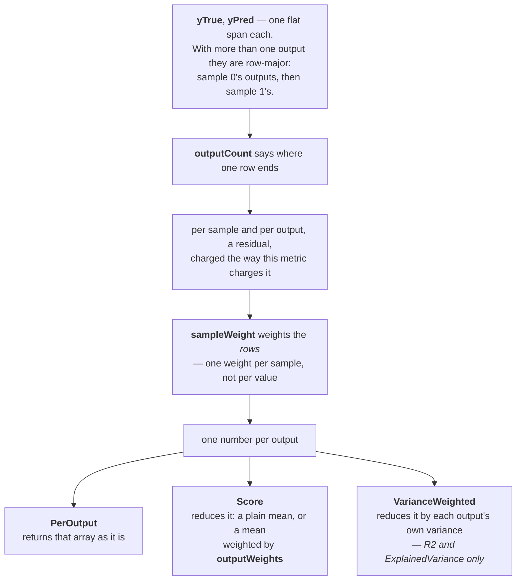
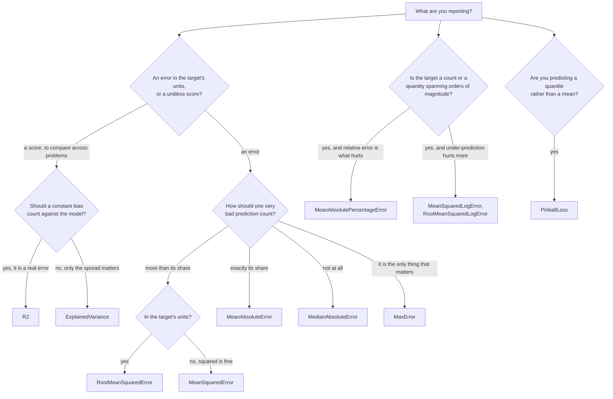

# Regression metrics — `DataNet.Metrics`

Your model predicted a number and the truth was a different number. How wrong is that? Every type on
this page answers it, and they disagree about what "wrong" should cost. Squaring the miss makes one
bad prediction dominate; taking the median makes it disappear entirely; dividing by the truth makes
being 1 out on 10 as bad as being 100 out on 1000. None of these is the correct answer — the right
one is the one that matches what a mistake actually costs you — and reporting the wrong one is the
usual reason a model that looks good on a metric behaves badly in use.

Two families sit here, and it is worth knowing which one you are reading.

- An **error** — everything with `Error` or `Loss` in its name — is `0` when the prediction is
  perfect and grows without bound. It is in the units of your target, or their square, so `0.5` means
  nothing until you know what the target was measured in.
- A **score** — `R2` and `ExplainedVariance` — is `1` when the prediction is perfect, `0` for a model
  no better than always predicting the mean, and **negative** for one that is worse than that. It is
  unitless, so it can be compared across problems, which is precisely what an error cannot do.

## How the parameters fit together

Everything here except `MaxError` shares one shape, and reading it once saves reading it eleven
times.



`outputCount` defaults to `1`, which is the ordinary case: one target per sample, one number out.
There is no two-dimensional overload because a `ReadOnlySpan<T>` cannot carry one, and `PerOutput`
is a method rather than an enum member because it changes the return type —
[decision 0021](../../decisions/0021-multioutput-is-a-method-not-an-enum.md).

Two refusals every metric here shares, both reproducing the message their Python layer prints. A
`sampleWeight` that is zero **throughout** is refused — the rule is every weight, not the sum, so
`[-1, -2, -3]` still scores — and `outputWeights` whose **sum** is zero are refused, so `[1, -1]` is
refused and `[-1, -1]` scores. Both arrive as `ArgumentException`. Non-finite values in `yTrue` or
`yPred` are refused too.

Classification metrics — how often a label was right — are on the
[classification page](classification.md), not here. `ZeroDivision`, which `R2` takes, is documented
there.

## Which one do I report?



| Type | What it measures |
| --- | --- |
| [`ExplainedVariance`](#explainedvariance) | The share of the truth's spread the prediction accounts for, ignoring a constant bias. |
| [`MaxError`](#maxerror) | The single worst prediction, and nothing else. |
| [`MeanAbsoluteError`](#meanabsoluteerror) | The average miss, in the target's own units. |
| [`MeanAbsolutePercentageError`](#meanabsolutepercentageerror) | The average miss as a fraction of the truth. |
| [`MeanSquaredError`](#meansquarederror) | The average squared miss — the one big errors dominate. |
| [`MeanSquaredLogError`](#meansquaredlogerror) | The same, on `log(1 + y)`, so a ratio matters more than a difference. |
| [`MedianAbsoluteError`](#medianabsoluteerror) | The typical miss, immune to any number of outliers. |
| [`PinballLoss`](#pinballloss) | The loss for a quantile prediction, charging over- and under-shooting differently. |
| [`R2`](#r2) | How much better than always predicting the mean, as a unitless score. |
| [`RootMeanSquaredError`](#rootmeansquarederror) | `MeanSquaredError` back in the target's units. |
| [`RootMeanSquaredLogError`](#rootmeansquaredlogerror) | `MeanSquaredLogError` back in log units. |

## Reference

### ExplainedVariance

`R2`'s forgiving cousin: it measures whether the prediction tracks the truth's ups and downs, and
does not charge for being consistently off by a fixed amount.

#### ExplainedVariance.Score

One number for the whole prediction: the share of the truth's variance the residuals do not carry.

<!-- docs-declaration -->

```csharp
public static double Score(ReadOnlySpan<double> yTrue, ReadOnlySpan<double> yPred, int outputCount = 1, ReadOnlySpan<double> sampleWeight = default, ReadOnlySpan<double> outputWeights = default, bool forceFinite = true)
```

**Parameters** — `yTrue` and `yPred` are the true and predicted values, the same length and
row-major when there is more than one output. `outputCount` is how many outputs each row holds, `1`
by default. `sampleWeight` weights the rows. `outputWeights` weights the outputs when the per-output
scores are reduced; omit it for a plain mean. `forceFinite` clamps the zero-variance case to `1` or
`0` rather than letting it be `nan` or `-inf`.

**Returns** — `double` at most `1`: `1` for a prediction that tracks the truth exactly up to a
constant, `0` for one no better than the mean, and negative for one that is worse.

**Exceptions** — `ArgumentException` when a length disagrees with the shape, the input is empty, or
it holds a non-finite value; `ArgumentOutOfRangeException` when `outputCount` is below one.

**Example** — a prediction that is right about every change and wrong by exactly `1` every time.
`R2.Score` on the same data is `-0.5`.

```csharp
using DataNet.Metrics;

double[] yTrue = [1.0, 2.0, 3.0];
double[] yPred = [2.0, 3.0, 4.0];

double explained = ExplainedVariance.Score(yTrue, yPred);   // => 1
```

**Remarks** — one term separates this from `R2`, and the example above is it: the residuals are
centred on their own mean before being squared, so a **uniform bias costs nothing here and costs
`R2` everything**. That makes this the right metric when the offset is going to be calibrated away
later — a sensor with an unknown zero, a forecast you will recentre — and the wrong one when the
offset is the error you are trying to measure.

Because a bias is free, this is always at least as large as `R2` on the same data, and the gap
between the two is exactly the bias. Reporting both is a cheap and unusually informative pair: equal
numbers mean the model is unbiased, and a wide gap says the shape is right and the level is not.

The trap is quoting it alone as though it were `R2`. A model that predicts `y + 1000` scores `1` here
and is useless. If a reader is going to see one number, `R2` is the safer one.

Unlike `R2`, this takes no `ZeroDivision`: it has no fewer-than-two-samples case to route, so
`ExplainedVariance.Score([3.0], [5.0])` is `1.0` where `R2.Score` on the same input is `NaN`. The
reasoning is in
[decision 0026](../../decisions/0026-r2-and-explainedvariance-split-their-undefined-cases-differently.md).

**Applies to** — net10.0, netstandard2.0.

**See also** — `ExplainedVariance.PerOutput`, `ExplainedVariance.VarianceWeighted`, `R2.Score`,
[decision 0026](../../decisions/0026-r2-and-explainedvariance-split-their-undefined-cases-differently.md),
the [Python equivalence table](../../equivalence.md).

#### ExplainedVariance.PerOutput

One score per output, unreduced.

<!-- docs-declaration -->

```csharp
public static double[] PerOutput(ReadOnlySpan<double> yTrue, ReadOnlySpan<double> yPred, int outputCount = 1, ReadOnlySpan<double> sampleWeight = default, bool forceFinite = true)
```

**Parameters** — `yTrue` and `yPred` are the true and predicted values, row-major. `outputCount` is
how many outputs each row holds, `sampleWeight` weights the rows, and `forceFinite` clamps the
zero-variance case.

**Returns** — a fresh `double[]` of `outputCount` entries, in column order.

**Exceptions** — `ArgumentException` when a length disagrees with the shape, the input is empty, or
it holds a non-finite value; `ArgumentOutOfRangeException` when `outputCount` is below one.

**Example** — three samples, two outputs; the second output is predicted with a constant offset and
therefore scores perfectly here.

```csharp
using DataNet.Metrics;

double[] yTrue = [0.5, 1.0, -1.0, 1.0, 7.0, -6.0];
double[] yPred = [0.0, 2.0, -1.0, 2.0, 8.0, -5.0];

double[] perOutput = ExplainedVariance.PerOutput(yTrue, yPred, outputCount: 2);
double first = perOutput[0];    // => 0.9677…
double second = perOutput[1];   // => 1
```

**Remarks** — this is scikit-learn's `multioutput="raw_values"`, and the reason to want it is that a
mean over outputs hides which output is failing. The array is in column order: entry `i` is the
score of the value at offset `i` of every row.

The trap is the layout of the input rather than of the output. `yTrue` and `yPred` are **row-major**
— one sample's outputs are contiguous — which is the transpose of a column-per-output table. Passing
a column-major array with the right `outputCount` produces numbers rather than an error, and they are
meaningless.

**Applies to** — net10.0, netstandard2.0.

**See also** — `ExplainedVariance.Score`, `ExplainedVariance.VarianceWeighted`, `R2.PerOutput`,
the [Python equivalence table](../../equivalence.md).

#### ExplainedVariance.VarianceWeighted

One number, each output counted in proportion to how much its own truth varies.

<!-- docs-declaration -->

```csharp
public static double VarianceWeighted(ReadOnlySpan<double> yTrue, ReadOnlySpan<double> yPred, int outputCount, ReadOnlySpan<double> sampleWeight = default, bool forceFinite = true)
```

**Parameters** — `yTrue` and `yPred` are the true and predicted values, row-major. `outputCount` is
how many outputs each row holds, and unlike the other two members it has no default — asking for a
variance-weighted average of one output is a mistake worth catching at the call site.
`sampleWeight` weights the rows, and `forceFinite` clamps the zero-variance case.

**Returns** — `double` at most `1`.

**Exceptions** — `ArgumentException` when a length disagrees with the shape, the input is empty, or
it holds a non-finite value; `ArgumentOutOfRangeException` when `outputCount` is below one.

**Example** — the same two outputs, the busier one counting for more.

```csharp
using DataNet.Metrics;

double[] yTrue = [0.5, 1.0, -1.0, 1.0, 7.0, -6.0];
double[] yPred = [0.0, 2.0, -1.0, 2.0, 8.0, -5.0];

double weighted = ExplainedVariance.VarianceWeighted(yTrue, yPred, outputCount: 2);   // => 0.9830…
```

**Remarks** — a plain mean over outputs treats a target that barely moves as equal in importance to
one that swings widely, which is rarely what anyone means. This weights each output by the variance
of its own truth, so the outputs that carry the information carry the score.

It is a method rather than an `outputWeights` value you could pass to `Score`, because the weights
are this computation's own per-output variances: they come out of the same pass that produced the
scores and cannot be recovered from the scores alone —
[decision 0021](../../decisions/0021-multioutput-is-a-method-not-an-enum.md).

The trap is that it is not comparable with `Score` across datasets. Two models on the same data can
be ranked by either, but a variance-weighted number and a uniform-average number are different
summaries, and swapping one for the other between two reports invents a change that is not there.

**Applies to** — net10.0, netstandard2.0.

**See also** — `ExplainedVariance.Score`, `ExplainedVariance.PerOutput`, `R2.VarianceWeighted`,
[decision 0021](../../decisions/0021-multioutput-is-a-method-not-an-enum.md),
the [Python equivalence table](../../equivalence.md).

### MaxError

The worst single prediction. Not an average of anything.

#### MaxError.Score

The largest absolute difference between a true value and its prediction.

<!-- docs-declaration -->

```csharp
public static double Score(ReadOnlySpan<double> yTrue, ReadOnlySpan<double> yPred)
```

**Parameters** — `yTrue` and `yPred` are the true and predicted values, one per sample and the same
length. There is nothing else: no weights and no multioutput.

**Returns** — `double`, never negative, `0` only when every prediction is exact. In the target's own
units.

**Exceptions** — `ArgumentException` when the spans disagree in length, are empty, or hold a
non-finite value.

**Example** — three predictions are perfect and one is out by 96.

```csharp
using DataNet.Metrics;

double[] yTrue = [1.0, 2.0, 3.0, 100.0];
double[] yPred = [1.0, 2.0, 3.0, 4.0];

double worst = MaxError.Score(yTrue, yPred);   // => 96
```

**Remarks** — this is the metric for a guarantee rather than for a summary: "no dose is ever off by
more than this", "no invoice is ever wrong by more than this". If your requirement is a bound, this
is the only number on the page that measures it, because every other one can be excellent while a
single catastrophic prediction hides inside it — on the data above, `MedianAbsoluteError.Score` is
`0`.

The trap is the mirror image, and it is why nobody optimises this: it is decided by **one sample**,
so it is as noisy as your worst label. One mistyped value in a dataset moves this number and no
other. Report it beside an average, never instead of one.

The missing parameters are fidelity, not an oversight. `max_error` accepts no `sample_weight` and
refuses a two-dimensional target outright, and the reason is real: a worst case is not an average,
so there is nothing for a weight to scale.

**Applies to** — net10.0, netstandard2.0.

**See also** — `MedianAbsoluteError.Score`, `MeanAbsoluteError.Score`, `MeanSquaredError.Score`,
the [Python equivalence table](../../equivalence.md).

### MeanAbsoluteError

The average size of a miss, in the units you measured in — the default when nothing else is called
for.

#### MeanAbsoluteError.Score

The mean of the absolute residuals.

<!-- docs-declaration -->

```csharp
public static double Score(ReadOnlySpan<double> yTrue, ReadOnlySpan<double> yPred, int outputCount = 1, ReadOnlySpan<double> sampleWeight = default, ReadOnlySpan<double> outputWeights = default)
```

**Parameters** — `yTrue` and `yPred` are the true and predicted values, row-major when there is more
than one output. `outputCount` is how many outputs each row holds. `sampleWeight` weights the rows —
one weight per sample, not per value. `outputWeights` weights the outputs in the reduction; omit it
for a plain mean.

**Returns** — `double`, never negative, `0` only for an exact prediction. In the target's own units.

**Exceptions** — `ArgumentException` when a length disagrees with the shape, the input is empty, or
it holds a non-finite value; `ArgumentOutOfRangeException` when `outputCount` is below one.

**Example** — four predictions, out by 0.5, 0.5, 0 and 1.

```csharp
using DataNet.Metrics;

double[] yTrue = [3.0, -0.5, 2.0, 7.0];
double[] yPred = [2.5, 0.0, 2.0, 8.0];

double error = MeanAbsoluteError.Score(yTrue, yPred);   // => 0.5
```

**Remarks** — start here. It is the only error on this page that reads directly as a sentence a
non-specialist understands — "on average we are half a unit out" — and it charges every unit of
error the same, which is what most costs actually do.

Its defining property is what it does **not** do: nothing is squared, so one prediction that is ten
times worse counts ten times, not a hundred times. That is the whole choice between this and
`MeanSquaredError.Score`. On `[1, 2, 3, 100]` against `[1, 2, 3, 4]` this reports `24` and mean
squared error reports `2304`, and neither is wrong — they answer "how far out on average" and "how
badly does the worst case hurt".

Two things worth knowing. It is not differentiable at zero, which is why models are so often trained
on squared error and then reported with this one; that mismatch is normal and not a mistake. And the
accumulation is Neumaier-compensated, so the answer is at least as accurate as numpy's pairwise
reduction rather than merely close to it —
[decision 0033](../../decisions/0033-compensated-sum-is-neumaiers-variant.md).

The trap is comparing it across targets. `0.5` is excellent on a target that ranges over thousands
and hopeless on one that ranges over one; it carries units, so it cannot rank two different problems.
`R2.Score` is what does that.

**Applies to** — net10.0, netstandard2.0.

**See also** — `MeanAbsoluteError.PerOutput`, `MeanSquaredError.Score`, `MedianAbsoluteError.Score`,
`R2.Score`, the [Python equivalence table](../../equivalence.md).

#### MeanAbsoluteError.PerOutput

One mean absolute error per output, unreduced.

<!-- docs-declaration -->

```csharp
public static double[] PerOutput(ReadOnlySpan<double> yTrue, ReadOnlySpan<double> yPred, int outputCount = 1, ReadOnlySpan<double> sampleWeight = default)
```

**Parameters** — `yTrue` and `yPred` are the true and predicted values, row-major. `outputCount` is
how many outputs each row holds, and `sampleWeight` weights the rows.

**Returns** — a fresh `double[]` of `outputCount` entries, in column order.

**Exceptions** — `ArgumentException` when a length disagrees with the shape, the input is empty, or
it holds a non-finite value; `ArgumentOutOfRangeException` when `outputCount` is below one.

**Example** — three samples, two outputs, the second predicted twice as badly as the first.

```csharp
using DataNet.Metrics;

double[] yTrue = [0.5, 1.0, -1.0, 1.0, 7.0, -6.0];
double[] yPred = [0.0, 2.0, -1.0, 2.0, 8.0, -5.0];

double[] perOutput = MeanAbsoluteError.PerOutput(yTrue, yPred, outputCount: 2);
double first = perOutput[0];    // => 0.5
double second = perOutput[1];   // => 1
```

**Remarks** — scikit-learn's `multioutput="raw_values"`. Reach for it whenever the outputs are not
interchangeable — a model predicting both a price and a delay has no useful average of the two, and
`Score`'s plain mean of them is a number in no units at all.

`outputWeights` on `Score` is the middle ground when the outputs *are* commensurable but not equally
important, and it is applied to exactly this array. There is no separate weighted-array form because
weighting an array you are not reducing means nothing.

The trap is `outputCount` silently succeeding. It is only checked against the total length, so
passing `2` for data that is really three outputs wide will slice the span into pairs and return two
numbers computed from the wrong columns.

**Applies to** — net10.0, netstandard2.0.

**See also** — `MeanAbsoluteError.Score`, `MeanSquaredError.PerOutput`, `MedianAbsoluteError.PerOutput`,
the [Python equivalence table](../../equivalence.md).

### MeanAbsolutePercentageError

The miss as a fraction of the truth, for targets whose scale changes from sample to sample.

#### MeanAbsolutePercentageError.Score

The mean of `|yTrue - yPred| / |yTrue|`, with the denominator clamped away from zero.

<!-- docs-declaration -->

```csharp
public static double Score(ReadOnlySpan<double> yTrue, ReadOnlySpan<double> yPred, int outputCount = 1, ReadOnlySpan<double> sampleWeight = default, ReadOnlySpan<double> outputWeights = default)
```

**Parameters** — `yTrue` and `yPred` are the true and predicted values, row-major when there is more
than one output. `outputCount` is how many outputs each row holds, `sampleWeight` weights the rows,
and `outputWeights` weights the outputs in the reduction.

**Returns** — `double`, never negative, and a **fraction rather than a percentage** despite the
name: `0.125` means 12.5%. It has no upper bound.

**Exceptions** — `ArgumentException` when a length disagrees with the shape, the input is empty, or
it holds a non-finite value; `ArgumentOutOfRangeException` when `outputCount` is below one.

**Example** — four quantities of very different sizes, each predicted about 10% out.

```csharp
using DataNet.Metrics;

double[] yTrue = [100.0, 50.0, 200.0, 25.0];
double[] yPred = [110.0, 45.0, 180.0, 30.0];

double error = MeanAbsolutePercentageError.Score(yTrue, yPred);   // => 0.125
```

**Remarks** — this is the metric for targets that span orders of magnitude, where being 10 out on a
sale of 100 and 1000 out on a sale of 10 000 are the same mistake. `MeanAbsoluteError.Score` would
report the second as a hundred times worse; this reports them as equal, which is usually what a
business means by "how accurate is the forecast".

Three traps, and the first one bites everybody.

**The result is a fraction, not a percentage.** Multiply by 100 before putting a `%` on it.

**It is asymmetric, and it rewards under-prediction.** The denominator is the truth, so a prediction
of `0` on a truth of `100` scores `1.0` — the worst a prediction can score by under-shooting — while
a prediction of `300` on the same truth scores `2.0`. A model tuned to minimise this will predict low
on purpose.

**A truth near zero explodes it.** The denominator is clamped at numpy's machine epsilon, `2^-52`,
which is not the same thing as .NET's `double.Epsilon` — that is 292 orders of magnitude smaller —
so `MeanAbsolutePercentageError.Score([0.0], [1.0])` is `4503599627370496.0` rather than infinity.
The number is finite, matches scikit-learn exactly, and is still meaningless: one sample whose truth
is zero will dominate any average it lands in. Filter them out or use another metric.

**Applies to** — net10.0, netstandard2.0.

**See also** — `MeanAbsolutePercentageError.PerOutput`, `MeanAbsoluteError.Score`,
`MeanSquaredLogError.Score`, the [Python equivalence table](../../equivalence.md).

#### MeanAbsolutePercentageError.PerOutput

One mean absolute percentage error per output, unreduced.

<!-- docs-declaration -->

```csharp
public static double[] PerOutput(ReadOnlySpan<double> yTrue, ReadOnlySpan<double> yPred, int outputCount = 1, ReadOnlySpan<double> sampleWeight = default)
```

**Parameters** — `yTrue` and `yPred` are the true and predicted values, row-major. `outputCount` is
how many outputs each row holds, and `sampleWeight` weights the rows.

**Returns** — a fresh `double[]` of `outputCount` entries, in column order.

**Exceptions** — `ArgumentException` when a length disagrees with the shape, the input is empty, or
it holds a non-finite value; `ArgumentOutOfRangeException` when `outputCount` is below one.

**Example** — the same four numbers read as two samples of two outputs.

```csharp
using DataNet.Metrics;

double[] yTrue = [100.0, 50.0, 200.0, 25.0];
double[] yPred = [110.0, 45.0, 180.0, 30.0];

double[] perOutput = MeanAbsolutePercentageError.PerOutput(yTrue, yPred, outputCount: 2);
double first = perOutput[0];    // => 0.1
double second = perOutput[1];   // => 0.15…
```

**Remarks** — because this metric is already scale-free, its per-output array is one of the few here
whose entries are directly comparable with one another: two outputs measured in different units still
produce two percentages. That makes `Score`'s plain mean of them meaningful in a way that
`MeanAbsoluteError.Score`'s is not.

The trap is that "scale-free" is a claim about the units, not about the data. An output whose truth
sits near zero for some samples still explodes, and its entry will then dominate the mean over
outputs exactly as it would dominate a mean over samples.

**Applies to** — net10.0, netstandard2.0.

**See also** — `MeanAbsolutePercentageError.Score`, `MeanAbsoluteError.PerOutput`,
the [Python equivalence table](../../equivalence.md).

### MeanSquaredError

The average squared miss: the metric models are trained on, and the one big errors dominate.

#### MeanSquaredError.Score

The mean of the squared residuals.

<!-- docs-declaration -->

```csharp
public static double Score(ReadOnlySpan<double> yTrue, ReadOnlySpan<double> yPred, int outputCount = 1, ReadOnlySpan<double> sampleWeight = default, ReadOnlySpan<double> outputWeights = default)
```

**Parameters** — `yTrue` and `yPred` are the true and predicted values, row-major when there is more
than one output. `outputCount` is how many outputs each row holds, `sampleWeight` weights the rows,
and `outputWeights` weights the outputs in the reduction.

**Returns** — `double`, never negative, `0` only for an exact prediction. In the **square** of the
target's units.

**Exceptions** — `ArgumentException` when a length disagrees with the shape, the input is empty, or
it holds a non-finite value; `ArgumentOutOfRangeException` when `outputCount` is below one.

**Example** — the same four predictions `MeanAbsoluteError.Score` scores `0.5`.

```csharp
using DataNet.Metrics;

double[] yTrue = [3.0, -0.5, 2.0, 7.0];
double[] yPred = [2.5, 0.0, 2.0, 8.0];

double error = MeanSquaredError.Score(yTrue, yPred);   // => 0.375
```

**Remarks** — squaring is the whole design, and it has two consequences that pull in opposite
directions. It makes the metric differentiable everywhere, which is why almost every regression model
minimises it during training. And it makes one bad prediction count out of all proportion: on
`[1, 2, 3, 100]` against `[1, 2, 3, 4]` this is `2304` where `MeanAbsoluteError.Score` is `24`. If
your costs really do grow faster than the error does — a bridge, a dosage — that is the right
behaviour. If they do not, it is a metric that will let one bad label decide which model you ship.

The trap is the units. This is in the **square** of the target's units, so a mean squared error of
`0.375` on a target measured in metres is `0.375` square metres, which is not a distance and is not
comparable to a mean absolute error of `0.5`. `RootMeanSquaredError.Score` puts it back into metres,
and is what you should report to anyone who is going to read the number rather than optimise it.

The accumulation is Neumaier-compensated, at least as accurate as numpy's pairwise reduction rather
than merely close to it —
[decision 0033](../../decisions/0033-compensated-sum-is-neumaiers-variant.md).

**Applies to** — net10.0, netstandard2.0.

**See also** — `MeanSquaredError.PerOutput`, `RootMeanSquaredError.Score`, `MeanAbsoluteError.Score`,
`R2.Score`, the [Python equivalence table](../../equivalence.md).

#### MeanSquaredError.PerOutput

One mean squared error per output, unreduced.

<!-- docs-declaration -->

```csharp
public static double[] PerOutput(ReadOnlySpan<double> yTrue, ReadOnlySpan<double> yPred, int outputCount = 1, ReadOnlySpan<double> sampleWeight = default)
```

**Parameters** — `yTrue` and `yPred` are the true and predicted values, row-major. `outputCount` is
how many outputs each row holds, and `sampleWeight` weights the rows.

**Returns** — a fresh `double[]` of `outputCount` entries, in column order.

**Exceptions** — `ArgumentException` when a length disagrees with the shape, the input is empty, or
it holds a non-finite value; `ArgumentOutOfRangeException` when `outputCount` is below one.

**Example** — three samples, two outputs.

```csharp
using DataNet.Metrics;

double[] yTrue = [0.5, 1.0, -1.0, 1.0, 7.0, -6.0];
double[] yPred = [0.0, 2.0, -1.0, 2.0, 8.0, -5.0];

double[] perOutput = MeanSquaredError.PerOutput(yTrue, yPred, outputCount: 2);
double first = perOutput[0];    // => 0.4166…
double second = perOutput[1];   // => 1
```

**Remarks** — the per-output array is where a multioutput model is actually diagnosed, because
squared errors in different units cannot be averaged into anything meaningful. Two outputs, one in
euros and one in days, give a `Score` in "euros-squared and days-squared", which is not a quantity.

The trap follows from that: `outputWeights` on `Score` is often used to fix it, and it does not.
Weighting a euro-squared against a day-squared still leaves a number with no units. If the outputs
are on different scales, the fix is to normalise the targets or to report `R2.PerOutput`, which is
unitless by construction.

**Applies to** — net10.0, netstandard2.0.

**See also** — `MeanSquaredError.Score`, `RootMeanSquaredError.PerOutput`, `R2.PerOutput`,
the [Python equivalence table](../../equivalence.md).

### MeanSquaredLogError

Squared error on `log(1 + y)`: the metric for counts and quantities where being out by a factor
matters more than being out by an amount.

#### MeanSquaredLogError.Score

The mean of the squared differences of `log(1 + y)`.

<!-- docs-declaration -->

```csharp
public static double Score(ReadOnlySpan<double> yTrue, ReadOnlySpan<double> yPred, int outputCount = 1, ReadOnlySpan<double> sampleWeight = default, ReadOnlySpan<double> outputWeights = default)
```

**Parameters** — `yTrue` and `yPred` are the true and predicted values, row-major when there is more
than one output, and **every value must be above −1**. `outputCount` is how many outputs each row
holds, `sampleWeight` weights the rows, and `outputWeights` weights the outputs in the reduction.

**Returns** — `double`, never negative, `0` only for an exact prediction. In squared log units, which
are not the target's units and not a fraction either.

**Exceptions** — `ArgumentException` when a length disagrees with the shape, the input is empty, it
holds a non-finite value, or either array holds a value at or below `−1`;
`ArgumentOutOfRangeException` when `outputCount` is below one.

**Example** — four counts, one of them predicted 60% high.

```csharp
using DataNet.Metrics;

double[] yTrue = [3.0, 5.0, 2.5, 7.0];
double[] yPred = [2.5, 5.0, 4.0, 8.0];

double error = MeanSquaredLogError.Score(yTrue, yPred);   // => 0.0397…
```

**Remarks** — taking the logarithm first turns a *ratio* into a *difference*, so this charges
"predicted twice the truth" the same whether the truth was 10 or 10 000. That makes it the natural
metric for counts, demand, page views — anything that grows multiplicatively and where the small
values are as interesting as the large ones. `MeanSquaredError.Score` on such a target is decided
entirely by the largest few samples.

It is also **asymmetric on purpose**, and this is the reason to choose it over
`MeanAbsolutePercentageError.Score`: because `log` compresses upward, under-predicting is charged
more than over-predicting by the same factor. If running out of stock is worse than holding too
much, that asymmetry is the feature.

Two traps. The units are not interpretable — `0.0397…` is neither a count nor a percentage — so
report `RootMeanSquaredLogError.Score` if a human is going to read it, and even then it is a log
ratio. And **negative targets are refused**, not clamped: any value at or below `−1` raises
`ArgumentException`, because `log(1 + y)` is undefined there. The exception additionally names which
side the offending value was on, which scikit-learn's does not.

The logarithm is numpy's `log1p`, reached through Kahan's identity rather than `Math.Log(1.0 + x)`.
That is not decoration: on targets around `1e-9` the naive spelling is out by `1.7e-8` relative,
where this agrees with scikit-learn to a unit in the last place —
[decision 0028](../../decisions/0028-log1p-is-kahans-identity-not-math-log-1-plus-x.md).

**Applies to** — net10.0, netstandard2.0.

**See also** — `MeanSquaredLogError.PerOutput`, `RootMeanSquaredLogError.Score`,
`MeanAbsolutePercentageError.Score`,
[decision 0028](../../decisions/0028-log1p-is-kahans-identity-not-math-log-1-plus-x.md),
the [Python equivalence table](../../equivalence.md).

#### MeanSquaredLogError.PerOutput

One mean squared log error per output, unreduced.

<!-- docs-declaration -->

```csharp
public static double[] PerOutput(ReadOnlySpan<double> yTrue, ReadOnlySpan<double> yPred, int outputCount = 1, ReadOnlySpan<double> sampleWeight = default)
```

**Parameters** — `yTrue` and `yPred` are the true and predicted values, row-major, every value above
`−1`. `outputCount` is how many outputs each row holds, and `sampleWeight` weights the rows.

**Returns** — a fresh `double[]` of `outputCount` entries, in column order.

**Exceptions** — `ArgumentException` when a length disagrees with the shape, the input is empty, it
holds a non-finite value, or either array holds a value at or below `−1`;
`ArgumentOutOfRangeException` when `outputCount` is below one.

**Example** — the same four counts read as two samples of two outputs.

```csharp
using DataNet.Metrics;

double[] yTrue = [3.0, 5.0, 2.5, 7.0];
double[] yPred = [2.5, 5.0, 4.0, 8.0];

double[] perOutput = MeanSquaredLogError.PerOutput(yTrue, yPred, outputCount: 2);
double first = perOutput[0];    // => 0.0725…
double second = perOutput[1];   // => 0.0069…
```

**Remarks** — log units are at least the *same* units for every output, so unlike
`MeanSquaredError.PerOutput` these entries can honestly be compared and averaged even when the
targets are counts of different things.

The trap is the `−1` rule applying to the **whole span**, not per output. One negative value anywhere
in `yTrue` or `yPred` refuses the call, so a multioutput target with one column that can legitimately
go negative cannot use this at all — split the columns and score them separately.

**Applies to** — net10.0, netstandard2.0.

**See also** — `MeanSquaredLogError.Score`, `RootMeanSquaredLogError.PerOutput`,
the [Python equivalence table](../../equivalence.md).

### MedianAbsoluteError

The typical miss rather than the average one: immune to outliers, and to any number of them.

#### MedianAbsoluteError.Score

The median of the absolute residuals.

<!-- docs-declaration -->

```csharp
public static double Score(ReadOnlySpan<double> yTrue, ReadOnlySpan<double> yPred, int outputCount = 1, ReadOnlySpan<double> sampleWeight = default, ReadOnlySpan<double> outputWeights = default)
```

**Parameters** — `yTrue` and `yPred` are the true and predicted values, row-major when there is more
than one output. `outputCount` is how many outputs each row holds, `sampleWeight` weights the rows,
and `outputWeights` weights the outputs in the reduction.

**Returns** — `double`, never negative, in the target's own units.

**Exceptions** — `ArgumentException` when a length disagrees with the shape, the input is empty, or
it holds a non-finite value; `ArgumentOutOfRangeException` when `outputCount` is below one.

**Example** — three exact predictions and one catastrophic one. `MeanAbsoluteError.Score` on this
data is `24`.

```csharp
using DataNet.Metrics;

double[] yTrue = [1.0, 2.0, 3.0, 100.0];
double[] yPred = [1.0, 2.0, 3.0, 4.0];

double typical = MedianAbsoluteError.Score(yTrue, yPred);   // => 0
```

**Remarks** — reach for this when your data has outliers you do not believe in — mistyped labels, a
sensor that dropped out, a fraud in the training set. Its breakdown point is 50%: half your samples
can be arbitrarily wrong and this number does not move. That is a genuinely different question from
the one `MeanAbsoluteError.Score` answers, and reporting the two side by side is the fastest way to
see whether a dataset has a tail.

Which is the trap, stated as bluntly as the example above puts it: **`0` here does not mean the model
is good.** It means at least half the predictions are exact, and says nothing about the other half.
Never report this alone; pair it with `MeanAbsoluteError.Score` or `MaxError.Score`.

Under `sampleWeight` this stops being the value at the halfway point. scikit-learn takes an
*averaged* weighted percentile — the mean of the first value whose cumulative weight reaches half the
total and the one just past the last that comes within one machine epsilon of it — and that tolerance
is load-bearing rather than decoration: a uniform weight is *usually* the ordinary median and not
always. Measured, `[0.7] * 10` gives `5.0` on the weighted path against `4.5` unweighted, while
`[0.1] * 10` gives `4.5` on both. Both agree, divergently, with scikit-learn —
[decision 0024](../../decisions/0024-weighted-median-averages-within-scikit-learns-epsilon.md).

**Applies to** — net10.0, netstandard2.0.

**See also** — `MedianAbsoluteError.PerOutput`, `MeanAbsoluteError.Score`, `MaxError.Score`,
[decision 0024](../../decisions/0024-weighted-median-averages-within-scikit-learns-epsilon.md),
the [Python equivalence table](../../equivalence.md).

#### MedianAbsoluteError.PerOutput

One median absolute error per output, unreduced.

<!-- docs-declaration -->

```csharp
public static double[] PerOutput(ReadOnlySpan<double> yTrue, ReadOnlySpan<double> yPred, int outputCount = 1, ReadOnlySpan<double> sampleWeight = default)
```

**Parameters** — `yTrue` and `yPred` are the true and predicted values, row-major. `outputCount` is
how many outputs each row holds, and `sampleWeight` weights the rows.

**Returns** — a fresh `double[]` of `outputCount` entries, in column order.

**Exceptions** — `ArgumentException` when a length disagrees with the shape, the input is empty, or
it holds a non-finite value; `ArgumentOutOfRangeException` when `outputCount` is below one.

**Example** — three samples, two outputs; each column's median is taken separately.

```csharp
using DataNet.Metrics;

double[] yTrue = [0.5, 1.0, -1.0, 1.0, 7.0, -6.0];
double[] yPred = [0.0, 2.0, -1.0, 2.0, 8.0, -5.0];

double[] perOutput = MedianAbsoluteError.PerOutput(yTrue, yPred, outputCount: 2);
double first = perOutput[0];    // => 0.5
double second = perOutput[1];   // => 1
```

**Remarks** — the median is taken **per column**, which is the only definition that makes sense and
is worth stating because it is not what "the median of a matrix" would mean. Each output is sorted on
its own and its own middle value taken.

The trap is that a median does not decompose the way a mean does. The mean of the per-output medians
that `Score` returns is not the median of anything, so it is a summary of summaries rather than a
statistic of the data. On multioutput targets, read the array.

Internally each column is selected rather than fully sorted, which is what keeps this from costing an
`n log n` per output —
[decision 0025](../../decisions/0025-quickselect-replaces-a-full-sort-for-the-median.md). Nothing
about the answer depends on it.

**Applies to** — net10.0, netstandard2.0.

**See also** — `MedianAbsoluteError.Score`, `MeanAbsoluteError.PerOutput`,
[decision 0025](../../decisions/0025-quickselect-replaces-a-full-sort-for-the-median.md),
the [Python equivalence table](../../equivalence.md).

### PinballLoss

The loss for a model that predicts a quantile rather than a mean: over- and under-shooting are
charged different rates.

#### PinballLoss.Score

The mean pinball loss at the quantile `alpha`.

<!-- docs-declaration -->

```csharp
public static double Score(ReadOnlySpan<double> yTrue, ReadOnlySpan<double> yPred, double alpha = 0.5, int outputCount = 1, ReadOnlySpan<double> sampleWeight = default, ReadOnlySpan<double> outputWeights = default)
```

**Parameters** — `yTrue` and `yPred` are the true and predicted values, row-major when there is more
than one output. `alpha` is the quantile being scored, in `[0, 1]`, `0.5` by default. `outputCount`
is how many outputs each row holds, `sampleWeight` weights the rows, and `outputWeights` weights the
outputs in the reduction.

**Returns** — `double`, never negative, `0` only for an exact prediction. In the target's own units.

**Exceptions** — `ArgumentException` when a length disagrees with the shape, the input is empty, or
it holds a non-finite value; `ArgumentOutOfRangeException` when `outputCount` is below one, or
`alpha` is outside `[0, 1]` — including `NaN`.

**Example** — the same four predictions, scored at the median and at the 90th percentile. The model
over-predicts twice and under-predicts twice, so asking for a high quantile forgives it.

```csharp
using DataNet.Metrics;

double[] yTrue = [3.0, -0.5, 2.0, 7.0];
double[] yPred = [2.5, 0.0, 2.0, 8.0];

double median = PinballLoss.Score(yTrue, yPred);              // => 0.25
double ninetieth = PinballLoss.Score(yTrue, yPred, 0.9);      // => 0.15
```

**Remarks** — this is the metric for **prediction intervals** rather than point forecasts. If you are
training a model to output "the 90th percentile of tomorrow's demand", no symmetric error can score
it: the model is *supposed* to over-predict most of the time, and mean absolute error would punish it
for doing its job. Pinball loss charges an under-prediction `alpha` per unit and an over-prediction
`1 - alpha`, so it is minimised exactly by the true quantile.

`alpha = 0.5` charges both sides at 0.5, which makes it precisely **half** the mean absolute error —
`0.25` above against `MeanAbsoluteError.Score`'s `0.5`. That factor of two is not a normalization
anyone chose; it falls out of the definition, and it means the default is not interchangeable with
mean absolute error even though it ranks models identically.

Two traps. `alpha` is the quantile you asked the model for, not a tuning knob: scoring a median
forecast at `alpha = 0.9` produces a smaller number and tells you nothing. And the number is only
comparable between models asked for the *same* quantile — a 0.9 loss and a 0.5 loss on the same data
are different scales, as the example shows.

The name drops Python's `mean_` prefix to match the other ten types here; `alpha` outside `[0, 1]`
raises `ArgumentOutOfRangeException` where scikit-learn raises `InvalidParameterError`.

**Applies to** — net10.0, netstandard2.0.

**See also** — `PinballLoss.PerOutput`, `MeanAbsoluteError.Score`, `MedianAbsoluteError.Score`,
the [Python equivalence table](../../equivalence.md).

#### PinballLoss.PerOutput

One pinball loss per output, unreduced.

<!-- docs-declaration -->

```csharp
public static double[] PerOutput(ReadOnlySpan<double> yTrue, ReadOnlySpan<double> yPred, double alpha = 0.5, int outputCount = 1, ReadOnlySpan<double> sampleWeight = default)
```

**Parameters** — `yTrue` and `yPred` are the true and predicted values, row-major. `alpha` is the
quantile being scored, in `[0, 1]`. `outputCount` is how many outputs each row holds, and
`sampleWeight` weights the rows.

**Returns** — a fresh `double[]` of `outputCount` entries, in column order.

**Exceptions** — `ArgumentException` when a length disagrees with the shape, the input is empty, or
it holds a non-finite value; `ArgumentOutOfRangeException` when `outputCount` is below one, or
`alpha` is outside `[0, 1]` — including `NaN`.

**Example** — three samples, two outputs, at the median.

```csharp
using DataNet.Metrics;

double[] yTrue = [0.5, 1.0, -1.0, 1.0, 7.0, -6.0];
double[] yPred = [0.0, 2.0, -1.0, 2.0, 8.0, -5.0];

double[] perOutput = PinballLoss.PerOutput(yTrue, yPred, alpha: 0.5, outputCount: 2);
double first = perOutput[0];    // => 0.25
double second = perOutput[1];   // => 0.5
```

**Remarks** — the array is what you want when a model emits several quantiles of the same target and
you laid them out as outputs. It is also the one place the shared multioutput shape is slightly
awkward: `alpha` is a single value applied to **every** output, so scoring a 10th, a 50th and a 90th
percentile means three calls rather than one.

The trap is exactly that. A single call with three quantile columns and `alpha: 0.5` will return
three numbers, none of which is wrong arithmetic and only one of which means anything.

**Applies to** — net10.0, netstandard2.0.

**See also** — `PinballLoss.Score`, `MeanAbsoluteError.PerOutput`,
the [Python equivalence table](../../equivalence.md).

### R2

The coefficient of determination: how much better the model is than always predicting the mean,
as a unitless score.

#### R2.Score

One score for the whole prediction: `1` minus the residual variance over the truth's variance.

<!-- docs-declaration -->

```csharp
public static double Score(ReadOnlySpan<double> yTrue, ReadOnlySpan<double> yPred, int outputCount = 1, ReadOnlySpan<double> sampleWeight = default, ReadOnlySpan<double> outputWeights = default, bool forceFinite = true, ZeroDivision zeroDivision = ZeroDivision.NaN)
```

**Parameters** — `yTrue` and `yPred` are the true and predicted values, row-major when there is more
than one output. `outputCount` is how many outputs each row holds, `sampleWeight` weights the rows,
and `outputWeights` weights the outputs in the reduction. `forceFinite` answers the case where the
truth has no variance over two or more samples, clamping to `1` or `0` instead of `nan` or `-inf`.
`zeroDivision` answers the *different* case of fewer than two samples, and defaults to
`ZeroDivision.NaN`, which is scikit-learn's value.

**Returns** — `double` at most `1`: `1` for a perfect prediction, `0` for one exactly as good as
always predicting the mean, and negative — with no lower bound — for one that is worse.

**Exceptions** — `ArgumentException` when a length disagrees with the shape, the input is empty, or
it holds a non-finite value; `ArgumentOutOfRangeException` when `outputCount` is below one;
`UndefinedMetricException` when there are fewer than two samples and `zeroDivision` is
`ZeroDivision.Throw`.

**Example** — four predictions, close but not exact.

```csharp
using DataNet.Metrics;

double[] yTrue = [3.0, -0.5, 2.0, 7.0];
double[] yPred = [2.5, 0.0, 2.0, 8.0];

double score = R2.Score(yTrue, yPred);   // => 0.9486…
```

**Remarks** — this is the number to report when a reader has to judge the model without knowing the
target's units, and the only one on this page that can rank two different problems. Its zero point is
the thing to hold on to: `0` is what you get by ignoring the inputs entirely and predicting the mean
of the truth every time. A model that scores `0.1` is barely doing anything; a model that scores
below `0` is worse than that baseline, which is possible and much more common on held-out data than
people expect. There is no floor — a bad enough model scores `-14`.

The trap that catches people moving from `ExplainedVariance.Score` is that **`R2` charges for a
constant bias.** Predicting `y + 1` for every sample tracks the truth perfectly and scores `-0.5`
here, where explained variance scores `1`. That is the intended behaviour: an offset is a real error
unless you are going to remove it.

The two undefined cases are deliberately kept apart and must not be merged.

- **Fewer than two samples** is `zeroDivision`'s case: the truth has no variance to compare against
  because there is only one of it, and scikit-learn returns `nan` here whatever `force_finite` says.
  `R2.Score([2.0], [1.0])` is `NaN`.
- **A constant truth over two or more samples** is `forceFinite`'s case. With `forceFinite: true` —
  the default — a perfect prediction of that constant scores `1` and any other scores `0`; with
  `false` you get `nan` and `-inf` instead.

[Decision 0026](../../decisions/0026-r2-and-explainedvariance-split-their-undefined-cases-differently.md)
has the argument for keeping them separate. Both passes are Neumaier-compensated, which is
load-bearing on an ill-conditioned target: a sequential sum was measured 357 times outside the
oracle's tolerance —
[decision 0033](../../decisions/0033-compensated-sum-is-neumaiers-variant.md).

**Applies to** — net10.0, netstandard2.0.

**See also** — `R2.PerOutput`, `R2.VarianceWeighted`, `ExplainedVariance.Score`,
[decision 0026](../../decisions/0026-r2-and-explainedvariance-split-their-undefined-cases-differently.md),
[the ZeroDivision entry](classification.md#zerodivision),
the [Python equivalence table](../../equivalence.md).

#### R2.PerOutput

One score per output, unreduced.

<!-- docs-declaration -->

```csharp
public static double[] PerOutput(ReadOnlySpan<double> yTrue, ReadOnlySpan<double> yPred, int outputCount = 1, ReadOnlySpan<double> sampleWeight = default, bool forceFinite = true, ZeroDivision zeroDivision = ZeroDivision.NaN)
```

**Parameters** — `yTrue` and `yPred` are the true and predicted values, row-major. `outputCount` is
how many outputs each row holds, `sampleWeight` weights the rows, `forceFinite` answers a truth of
zero variance, and `zeroDivision` answers fewer than two samples.

**Returns** — a fresh `double[]` of `outputCount` entries, in column order.

**Exceptions** — `ArgumentException` when a length disagrees with the shape, the input is empty, or
it holds a non-finite value; `ArgumentOutOfRangeException` when `outputCount` is below one;
`UndefinedMetricException` when there are fewer than two samples and `zeroDivision` is
`ZeroDivision.Throw`.

**Example** — three samples, two outputs.

```csharp
using DataNet.Metrics;

double[] yTrue = [0.5, 1.0, -1.0, 1.0, 7.0, -6.0];
double[] yPred = [0.0, 2.0, -1.0, 2.0, 8.0, -5.0];

double[] perOutput = R2.PerOutput(yTrue, yPred, outputCount: 2);
double first = perOutput[0];    // => 0.9654…
double second = perOutput[1];   // => 0.9081…
```

**Remarks** — because `R2` is unitless, this is the multioutput array whose entries really are
comparable with one another, which is what makes it the honest way to look at a model predicting
several unrelated things. `MeanSquaredError.PerOutput` cannot do that.

There is one shape divergence from scikit-learn, and it is stated rather than hidden: on fewer than
two samples with more than one output, this returns **one `NaN` per output**, where `r2_score`
returns a single scalar `nan` before it ever consults `multioutput`. No number differs — every
scalar-returning path here still gives `NaN` — and a one-element array would break this method's own
contract of one value per output.

The trap is the same one `Score` has, one level down: a negative entry is not a bug. It means that
output is predicted worse than its own mean would be, and on a multioutput model that is usually one
column with almost no variance rather than a broken model.

**Applies to** — net10.0, netstandard2.0.

**See also** — `R2.Score`, `R2.VarianceWeighted`, `ExplainedVariance.PerOutput`,
the [Python equivalence table](../../equivalence.md).

#### R2.VarianceWeighted

One score, each output counted in proportion to how much its own truth varies.

<!-- docs-declaration -->

```csharp
public static double VarianceWeighted(ReadOnlySpan<double> yTrue, ReadOnlySpan<double> yPred, int outputCount, ReadOnlySpan<double> sampleWeight = default, bool forceFinite = true, ZeroDivision zeroDivision = ZeroDivision.NaN)
```

**Parameters** — `yTrue` and `yPred` are the true and predicted values, row-major. `outputCount` is
how many outputs each row holds and has no default, unlike the other two members. `sampleWeight`
weights the rows, `forceFinite` answers a truth of zero variance, and `zeroDivision` answers fewer
than two samples.

**Returns** — `double` at most `1`.

**Exceptions** — `ArgumentException` when a length disagrees with the shape, the input is empty, or
it holds a non-finite value; `ArgumentOutOfRangeException` when `outputCount` is below one;
`UndefinedMetricException` when there are fewer than two samples and `zeroDivision` is
`ZeroDivision.Throw`.

**Example** — the same two outputs, with the busier one counting for more.

```csharp
using DataNet.Metrics;

double[] yTrue = [0.5, 1.0, -1.0, 1.0, 7.0, -6.0];
double[] yPred = [0.0, 2.0, -1.0, 2.0, 8.0, -5.0];

double weighted = R2.VarianceWeighted(yTrue, yPred, outputCount: 2);   // => 0.9382…
```

**Remarks** — scikit-learn's `multioutput="variance_weighted"`. The case it exists for is a model
whose outputs differ wildly in how much they move: an output that is nearly constant is easy to
predict well and would otherwise pull a plain mean upward for no reason, and this weights it down to
almost nothing.

It is a method rather than a value you could pass as `outputWeights`, because the weights are this
computation's own per-output variances — produced by the same pass as the scores, and not recoverable
from them —
[decision 0021](../../decisions/0021-multioutput-is-a-method-not-an-enum.md).

The trap is that this quietly hides a failing output. An output the model is terrible at, whose truth
happens not to vary much, contributes almost nothing to the number. If you want to know whether every
output is predicted acceptably, read `R2.PerOutput`; this answers a different question, which is how
much of the total variance in the data the model accounted for.

**Applies to** — net10.0, netstandard2.0.

**See also** — `R2.Score`, `R2.PerOutput`, `ExplainedVariance.VarianceWeighted`,
[decision 0021](../../decisions/0021-multioutput-is-a-method-not-an-enum.md),
the [Python equivalence table](../../equivalence.md).

### RootMeanSquaredError

`MeanSquaredError` with the square root taken, which puts it back into the target's units — the
version to show a human.

#### RootMeanSquaredError.Score

The square root of the mean squared error, taken per output before the outputs are reduced.

<!-- docs-declaration -->

```csharp
public static double Score(ReadOnlySpan<double> yTrue, ReadOnlySpan<double> yPred, int outputCount = 1, ReadOnlySpan<double> sampleWeight = default, ReadOnlySpan<double> outputWeights = default)
```

**Parameters** — `yTrue` and `yPred` are the true and predicted values, row-major when there is more
than one output. `outputCount` is how many outputs each row holds, `sampleWeight` weights the rows,
and `outputWeights` weights the outputs in the reduction.

**Returns** — `double`, never negative, `0` only for an exact prediction. In the target's own units.

**Exceptions** — `ArgumentException` when a length disagrees with the shape, the input is empty, or
it holds a non-finite value; `ArgumentOutOfRangeException` when `outputCount` is below one.

**Example** — two outputs, showing that the root is taken **per output**: taking it after the
reduction instead gives a different number.

```csharp
using System;
using DataNet.Metrics;

double[] yTrue = [0.5, 1.0, -1.0, 1.0, 7.0, -6.0];
double[] yPred = [0.0, 2.0, -1.0, 2.0, 8.0, -5.0];

double rootThenMean = RootMeanSquaredError.Score(yTrue, yPred, outputCount: 2);          // => 0.8227…
double meanThenRoot = Math.Sqrt(MeanSquaredError.Score(yTrue, yPred, outputCount: 2));   // => 0.8416…
```

**Remarks** — this is the number to report. It is in the same units as the target, so "the model is
out by about 0.6 metres" is a sentence, and it is still dominated by large errors the way squared
error is — which is usually what you want a headline number to be. Beside `MeanAbsoluteError.Score`
it also carries information: the gap between the two grows with the spread of the errors, so
`RootMeanSquaredError.Score` much larger than mean absolute error says the errors are uneven rather
than uniformly middling.

A type of its own rather than a flag on `MeanSquaredError`, because scikit-learn deprecated
`mean_squared_error(squared=False)` in 1.4 and removed it in 1.6 in favour of a second function; a
`squared` parameter here would transcribe an API that no longer exists.

The trap is the order of operations on more than one output, which the example measures: the root is
taken **per output** and the reduction runs on the roots. That is scikit-learn's order, and it is not
the same number as the root of the reduced mean squared error whenever the outputs differ. On one
output the two coincide, which is why the difference goes unnoticed until a multioutput target
appears.

**Applies to** — net10.0, netstandard2.0.

**See also** — `RootMeanSquaredError.PerOutput`, `MeanSquaredError.Score`, `MeanAbsoluteError.Score`,
the [Python equivalence table](../../equivalence.md).

#### RootMeanSquaredError.PerOutput

One root mean squared error per output, unreduced.

<!-- docs-declaration -->

```csharp
public static double[] PerOutput(ReadOnlySpan<double> yTrue, ReadOnlySpan<double> yPred, int outputCount = 1, ReadOnlySpan<double> sampleWeight = default)
```

**Parameters** — `yTrue` and `yPred` are the true and predicted values, row-major. `outputCount` is
how many outputs each row holds, and `sampleWeight` weights the rows.

**Returns** — a fresh `double[]` of `outputCount` entries, in column order.

**Exceptions** — `ArgumentException` when a length disagrees with the shape, the input is empty, or
it holds a non-finite value; `ArgumentOutOfRangeException` when `outputCount` is below one.

**Example** — the roots `Score` then reduces.

```csharp
using DataNet.Metrics;

double[] yTrue = [0.5, 1.0, -1.0, 1.0, 7.0, -6.0];
double[] yPred = [0.0, 2.0, -1.0, 2.0, 8.0, -5.0];

double[] perOutput = RootMeanSquaredError.PerOutput(yTrue, yPred, outputCount: 2);
double first = perOutput[0];    // => 0.6454…
double second = perOutput[1];   // => 1
```

**Remarks** — this is exactly the square root of each entry of `MeanSquaredError.PerOutput`, and it
is the array `Score` averages. Reading it is how you find out which output the headline number is
being dragged down by, and unlike the squared version its entries are in each output's own units, so
they can be compared against those outputs' scales.

The trap is that they still cannot be compared against **each other** unless the outputs share a
unit. Two outputs, one in euros and one in days, give two numbers whose ratio means nothing — which
is what `R2.PerOutput` is for.

**Applies to** — net10.0, netstandard2.0.

**See also** — `RootMeanSquaredError.Score`, `MeanSquaredError.PerOutput`, `R2.PerOutput`,
the [Python equivalence table](../../equivalence.md).

### RootMeanSquaredLogError

`MeanSquaredLogError` with the square root taken, so the number reads as a log ratio rather than a
squared one.

#### RootMeanSquaredLogError.Score

The square root of the mean squared log error, taken per output before the outputs are reduced.

<!-- docs-declaration -->

```csharp
public static double Score(ReadOnlySpan<double> yTrue, ReadOnlySpan<double> yPred, int outputCount = 1, ReadOnlySpan<double> sampleWeight = default, ReadOnlySpan<double> outputWeights = default)
```

**Parameters** — `yTrue` and `yPred` are the true and predicted values, row-major when there is more
than one output, and every value must be above `−1`. `outputCount` is how many outputs each row
holds, `sampleWeight` weights the rows, and `outputWeights` weights the outputs in the reduction.

**Returns** — `double`, never negative, `0` only for an exact prediction. In log units.

**Exceptions** — `ArgumentException` when a length disagrees with the shape, the input is empty, it
holds a non-finite value, or either array holds a value at or below `−1`;
`ArgumentOutOfRangeException` when `outputCount` is below one.

**Example** — the same four counts `MeanSquaredLogError.Score` scores `0.0397…`.

```csharp
using DataNet.Metrics;

double[] yTrue = [3.0, 5.0, 2.5, 7.0];
double[] yPred = [2.5, 5.0, 4.0, 8.0];

double error = RootMeanSquaredLogError.Score(yTrue, yPred);   // => 0.1993…
```

**Remarks** — this is the one of the log pair to report, because a root log error has an approximate
reading a squared one does not: for small values, `0.1993…` is roughly "typically out by about 20%".
That approximation breaks down as the number grows — it is `exp(x) - 1` that gives the ratio — but it
is enough to make the metric quotable, which the squared version is not.

A type of its own rather than a flag, for the same reason `RootMeanSquaredError` is: scikit-learn
exposes it as its own function rather than as a `squared` parameter.

The trap is the same order-of-operations one: the root is taken **per output** before the reduction,
so on more than one output this is not the root of `MeanSquaredLogError.Score`. And the asymmetry the
logarithm introduces survives the root — under-prediction is still charged more than over-prediction
— so this is not a symmetric relative error however much the "about 20%" reading makes it sound like
one.

**Applies to** — net10.0, netstandard2.0.

**See also** — `RootMeanSquaredLogError.PerOutput`, `MeanSquaredLogError.Score`,
`MeanAbsolutePercentageError.Score`,
[decision 0028](../../decisions/0028-log1p-is-kahans-identity-not-math-log-1-plus-x.md),
the [Python equivalence table](../../equivalence.md).

#### RootMeanSquaredLogError.PerOutput

One root mean squared log error per output, unreduced.

<!-- docs-declaration -->

```csharp
public static double[] PerOutput(ReadOnlySpan<double> yTrue, ReadOnlySpan<double> yPred, int outputCount = 1, ReadOnlySpan<double> sampleWeight = default)
```

**Parameters** — `yTrue` and `yPred` are the true and predicted values, row-major, every value above
`−1`. `outputCount` is how many outputs each row holds, and `sampleWeight` weights the rows.

**Returns** — a fresh `double[]` of `outputCount` entries, in column order.

**Exceptions** — `ArgumentException` when a length disagrees with the shape, the input is empty, it
holds a non-finite value, or either array holds a value at or below `−1`;
`ArgumentOutOfRangeException` when `outputCount` is below one.

**Example** — the same four counts read as two samples of two outputs.

```csharp
using DataNet.Metrics;

double[] yTrue = [3.0, 5.0, 2.5, 7.0];
double[] yPred = [2.5, 5.0, 4.0, 8.0];

double[] perOutput = RootMeanSquaredLogError.PerOutput(yTrue, yPred, outputCount: 2);
double first = perOutput[0];    // => 0.2693…
double second = perOutput[1];   // => 0.0832…
```

**Remarks** — the entries are the square roots of `MeanSquaredLogError.PerOutput`'s, and they are the
array `Score` reduces. Every entry is in log units, so unlike `RootMeanSquaredError.PerOutput` these
really are comparable across outputs even when the targets count different things — which is one of
the better reasons to model counts in log space in the first place.

The trap is inherited whole from the squared form: one value at or below `−1` **anywhere** refuses
the call, per span and not per output, so a column that can legitimately go negative has to be scored
separately.

**Applies to** — net10.0, netstandard2.0.

**See also** — `RootMeanSquaredLogError.Score`, `MeanSquaredLogError.PerOutput`,
`RootMeanSquaredError.PerOutput`, the [Python equivalence table](../../equivalence.md).
