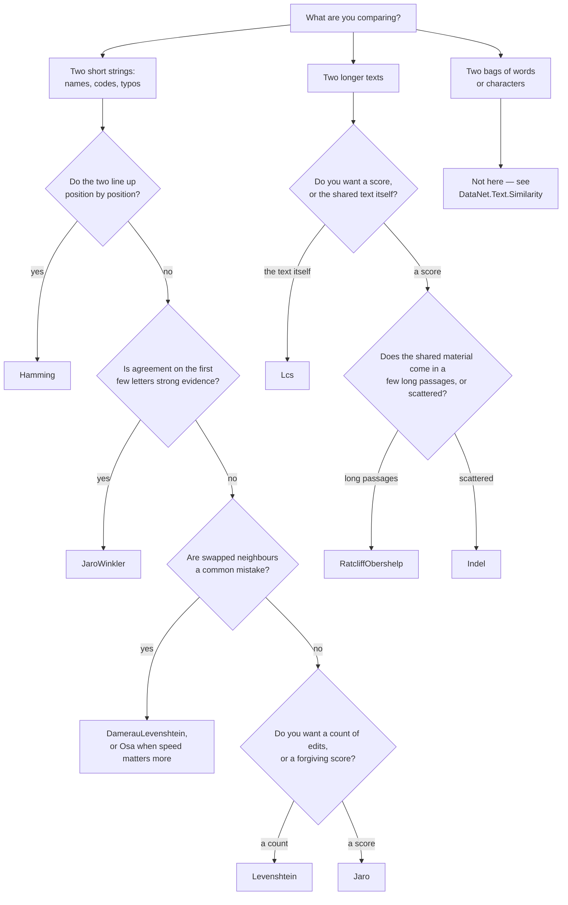

# Distances — `DataNet.Text.Distances`

How different are two pieces of text? Every type on this page answers that, and they disagree on
what "different" means: some count the edits that turn one string into the other, some check how
many characters line up in roughly the same place, and one looks for the longest stretches the two
have in common. Picking the wrong one is the usual cause of a similarity score that looks nothing
like what a reader expects.

Two conventions run through the whole namespace, and knowing them saves reading every entry.

- A **distance** counts how far apart two inputs are: `0` means identical, and a bigger number is a
  worse match. A **similarity** runs the other way, `1` meaning identical. What decides whether a
  number can be compared across pairs of different lengths is its type, not its name: a `Distance`
  returning `int` counts edits and has no upper bound, while every member returning `double` on this
  page — the `Normalized…` ones and also `Jaro`, `JaroWinkler` and `RatcliffObershelp` — is already
  scaled to `[0, 1]` and is comparable.
- Every member that takes a `string` also takes a `TextElement` saying what counts as one character.
  (The generic overloads — `Distance<T>`, `SubsequenceLength<T>`, `SubstringLength<T>` — do not: they
  compare whatever elements you hand them.) The default,
  `TextElement.Utf16Unit`, is .NET's own unit and gives the same answer as Python for every
  character in the Basic Multilingual Plane. Outside it — emoji, rare ideographs — one character is
  two UTF-16 units, and the two disagree on purpose; pass `TextElement.CodePoint` for Python's
  answer. The reasoning is in [decision 0002](../../decisions/0002-unicode-comparison-unit.md).

Comparing two **bags** of words or characters, where position does not matter at all, is a
different question. It is answered by the `DataNet.Text.Similarity` namespace — `Jaccard`,
`SorensenDice`, `Overlap`, `Tversky` and `Cosine` — not by anything here; its members are listed
under [set similarity in the equivalence table](../../equivalence.md).

## Which one do I want?



| Type | What it measures |
| --- | --- |
| [`DamerauLevenshtein`](#dameraulevenshtein) | Insertions, deletions, substitutions and swaps of neighbouring characters, with no limit on re-editing a stretch. |
| [`Hamming`](#hamming) | How many positions hold a different character, plus the difference in length. |
| [`Indel`](#indel) | Insertions and deletions only, never substitutions — the basis of rapidfuzz's `fuzz.ratio`. |
| [`Jaro`](#jaro) | How many characters the two share near the same position, and how many of those arrive out of order. |
| [`JaroWinkler`](#jarowinkler) | `Jaro`, raised for pairs that already agree on their first few characters. |
| [`Lcs`](#lcs) | The length of the longest run the two have in common, contiguous or not. |
| [`Levenshtein`](#levenshtein) | Insertions, deletions and substitutions. |
| [`Osa`](#osa) | The same as `DamerauLevenshtein`, except that no stretch of text may be edited twice. |
| [`RatcliffObershelp`](#ratcliffobershelp) | How much of the two texts their matching blocks cover, taken longest first. |

## Reference

### DamerauLevenshtein

The edit distance for text where two characters get typed in the wrong order: a swap costs one
edit, not two.

#### DamerauLevenshtein.Distance

Counts the fewest insertions, deletions, substitutions and swaps of neighbouring characters that
turn one string into the other.

<!-- docs-declaration -->

```csharp
public static int Distance(ReadOnlySpan<char> a, ReadOnlySpan<char> b, TextElement element = TextElement.Utf16Unit)
public static int Distance<T>(ReadOnlySpan<T> a, ReadOnlySpan<T> b) where T : IEquatable<T>
```

**Parameters** — `a` and `b` are the two strings to compare; a `string` converts implicitly, so
nothing is allocated for them. `element` says what counts as one character: `TextElement.Utf16Unit`
by default, the native and fastest choice, or `TextElement.CodePoint` to match Python outside the
Basic Multilingual Plane. The second overload takes any two spans of an `IEquatable<T>` — words,
tokens, decoded code points — and compares elements rather than characters.

**Returns** — `int`, the number of edits. Zero when the two are equal, and never negative.

**Example** — a swap and an insertion, where `Osa` charges three edits for the same pair.

```csharp
using DataNet.Text.Distances;

int d = DamerauLevenshtein.Distance("CA", "ABC");   // => 2
```

**Remarks** — reach for this instead of `Levenshtein` when the mistakes you are chasing are typing
mistakes: "teh" for "the" is one slip of the fingers, and `Levenshtein` charges two edits for it.
Reach for it instead of `Osa` when a stretch of text may need editing more than once — that single
restriction is the only difference between the two, and it is what makes `"CA"` to `"ABC"` cost 2
here and 3 there.

Where it matters most is the one place people expect the opposite. With unit costs this **is** a
proper metric — Lowrance-Wagner satisfies the triangle inequality because two transpositions never
cost less than an insertion plus a deletion — so it can be indexed by anything that needs one, a
BK-tree for nearest-neighbour lookup included. `Osa` cannot: restricting each stretch to a single
edit is exactly what breaks the inequality there, and `Osa.Distance("bca", "ab")` is 3 while the
route through `"ba"` costs `1 + 1`. If you are building an index rather than scoring one pair at a
time, that is the reason to take the unrestricted variant even though it costs more to compute.

The trap is the ordinary one for a raw distance: the result is unbounded, so three edits mean
something different between two names and between two paragraphs. Threshold on
`NormalizedSimilarity`, never on this.

**Applies to** — net10.0, netstandard2.0.

**See also** — `DamerauLevenshtein.NormalizedSimilarity`, `Osa.Distance`, `Levenshtein.Distance`,
the [Python equivalence table](../../equivalence.md).

#### DamerauLevenshtein.NormalizedDistance

Scales the distance into `[0, 1]` by dividing it by the length of the longer input.

<!-- docs-declaration -->

```csharp
public static double NormalizedDistance(ReadOnlySpan<char> a, ReadOnlySpan<char> b, TextElement element = TextElement.Utf16Unit)
```

**Parameters** — `a` and `b` are the two strings to compare. `element` says what counts as one
character, and it also decides the lengths the result is divided by, so it moves the denominator as
well as the distance.

**Returns** — `double` in `[0, 1]`: `0` when the two are equal, `1` when nothing at all can be
reused. Two empty inputs give `0` rather than a division by zero.

**Example** — one swap over six characters.

```csharp
using DataNet.Text.Distances;

double d = DamerauLevenshtein.NormalizedDistance("MARTHA", "MARHTA");   // => 0.1666…
```

**Remarks** — this is the form to threshold on ("reject anything above 0.2") and the only form
worth comparing across pairs of different lengths. The divisor is `max(len(a), len(b))`.

The trap is that "normalized" does not mean "interchangeable". `Indel.NormalizedDistance` divides
by the **sum** of the two lengths instead, so the same pair scores differently on the two scales and
a threshold tuned against one is meaningless against the other. Check the divisor before you move a
threshold between measures.

**Applies to** — net10.0, netstandard2.0.

**See also** — `DamerauLevenshtein.Distance`, `DamerauLevenshtein.NormalizedSimilarity`,
`Levenshtein.NormalizedDistance`, the [Python equivalence table](../../equivalence.md).

#### DamerauLevenshtein.NormalizedSimilarity

`1 - NormalizedDistance`: `1` when the two are identical, `0` when nothing is shared.

<!-- docs-declaration -->

```csharp
public static double NormalizedSimilarity(ReadOnlySpan<char> a, ReadOnlySpan<char> b, TextElement element = TextElement.Utf16Unit)
```

**Parameters** — `a` and `b` are the two strings to compare; `element` says what counts as one
character, exactly as it does for `NormalizedDistance`, which this is computed from.

**Returns** — `double` in `[0, 1]`, larger meaning more alike.

**Example** — the same pair as above, read the other way round.

```csharp
using DataNet.Text.Distances;

double s = DamerauLevenshtein.NormalizedSimilarity("MARTHA", "MARHTA");   // => 0.8333…
```

**Remarks** — use this rather than `NormalizedDistance` wherever a bigger number ought to mean a
better match: ranking candidates, sorting descending, or handing a score to something that expects
one. Nothing else about the two differs.

The trap is the empty case. `NormalizedDistance("", "")` is `0`, so this returns `1` — two empty
strings are reported as a perfect match. If an empty string means "this field was never filled in",
that is exactly backwards, and the filtering has to happen before the call.

**Applies to** — net10.0, netstandard2.0.

**See also** — `DamerauLevenshtein.NormalizedDistance`, `Osa.NormalizedSimilarity`,
`Levenshtein.NormalizedSimilarity`, the [Python equivalence table](../../equivalence.md).

### Hamming

Position-by-position comparison: the measure for fixed-width codes, where nothing ever shifts along.

#### Hamming.Distance

Counts the positions at which the two differ, then adds the difference in their lengths.

<!-- docs-declaration -->

```csharp
public static int Distance(ReadOnlySpan<char> a, ReadOnlySpan<char> b, TextElement element = TextElement.Utf16Unit)
public static int Distance<T>(ReadOnlySpan<T> a, ReadOnlySpan<T> b) where T : IEquatable<T>
```

**Parameters** — `a` and `b` are the two strings to compare, and they need not be the same length.
`element` says what counts as one position: `TextElement.Utf16Unit` by default, or
`TextElement.CodePoint` to count an emoji once instead of twice. The second overload compares any
two spans of an `IEquatable<T>`.

**Returns** — `int`, never negative, and `0` only when the two are equal.

**Example** — nothing can differ position by position here, so only the two missing characters
count.

```csharp
using DataNet.Text.Distances;

int d = Hamming.Distance("a", "abc");   // => 2
```

**Remarks** — this is the right measure for things that are aligned by construction: fixed-width
identifiers, ISBNs, hashes, DNA reads, two readings of the same fixed-length field. It is also by
far the cheapest thing on this page, a single pass with no matrix behind it.

It is the wrong measure the moment anything can shift. Inserting one character at the front of a
string makes every later position disagree, so `Hamming.Distance("abcdef", "xabcdef")` is 7 where
`Levenshtein` says 1. If insertions are possible at all, you want `Levenshtein` or `Indel`.

The textbook definition is undefined for inputs of different lengths; this one is not — it charges
the length difference and carries on, so a wrong-length input returns a number instead of throwing,
and a length bug will read as a large distance rather than as an error. Against combining marks and
mixed scripts the result also deliberately differs from `jellyfish.hamming_distance`, which
diverges from the standard definition there; the measurements are in
[decision 0005](../../decisions/0005-hamming-jellyfish-divergence.md).

**Applies to** — net10.0, netstandard2.0.

**See also** — `Hamming.NormalizedSimilarity`, `Levenshtein.Distance`, `Indel.Distance`,
the [Python equivalence table](../../equivalence.md).

#### Hamming.NormalizedSimilarity

Turns the distance into a score in `[0, 1]`: `1 - distance / max(len(a), len(b))`.

<!-- docs-declaration -->

```csharp
public static double NormalizedSimilarity(ReadOnlySpan<char> a, ReadOnlySpan<char> b, TextElement element = TextElement.Utf16Unit)
```

**Parameters** — `a` and `b` are the two strings to compare; `element` says what counts as one
position, and here it changes the answer, because it changes both how many positions there are and
how long the inputs are.

**Returns** — `double` in `[0, 1]`, larger meaning more alike. Two empty inputs give `1`.

**Example** — the emoji is one code point but two UTF-16 units, so the unit chosen moves the score.

```csharp
using DataNet.Text;
using DataNet.Text.Distances;

double s = Hamming.NormalizedSimilarity("a\U0001F600", "a", TextElement.CodePoint);   // => 0.5
```

**Remarks** — jellyfish exposes only the integer distance, so this member has no Python counterpart
to be compared against; it exists because a raw Hamming distance is as incomparable across pairs as
any other raw distance. Use it to threshold, and the integer form to report.

Two traps sit next to each other here. The empty case returns `1`, treating two blank fields as a
perfect match. And because the divisor is the **longer** length, a short input compared against a
long one is punished twice — once for every position that differs and once for the length gap —
which is the intended reading for fixed-width data and a misleading one for anything else.

**Applies to** — net10.0, netstandard2.0.

**See also** — `Hamming.Distance`, `Levenshtein.NormalizedSimilarity`,
[decision 0005](../../decisions/0005-hamming-jellyfish-divergence.md),
the [Python equivalence table](../../equivalence.md).

### Indel

Edits that may only add or remove, never replace — which is what makes it the measure behind
rapidfuzz's `fuzz.ratio`.

#### Indel.Distance

Counts the fewest insertions and deletions that turn one string into the other, with substitution
not allowed.

<!-- docs-declaration -->

```csharp
public static int Distance(ReadOnlySpan<char> a, ReadOnlySpan<char> b, TextElement element = TextElement.Utf16Unit)
public static int Distance<T>(ReadOnlySpan<T> a, ReadOnlySpan<T> b) where T : IEquatable<T>
```

**Parameters** — `a` and `b` are the two strings to compare. `element` says what counts as one
character: `TextElement.Utf16Unit` by default, or `TextElement.CodePoint` for Python's answer
outside the Basic Multilingual Plane. The second overload compares any two spans of an
`IEquatable<T>`.

**Returns** — `int`, the number of insertions and deletions. Zero when the two are equal, and never
negative.

**Example** — five insertions and deletions where `Levenshtein`, allowed to substitute, needs only
three edits.

```csharp
using DataNet.Text.Distances;

int d = Indel.Distance("kitten", "sitting");   // => 5
```

**Remarks** — every substitution costs two here, one delete and one insert, so this is always at
least as large as `Levenshtein` and usually larger. That is the point: it is the measure that
weights a replaced character as heavily as a lost one, which is what makes it match how people
judge two versions of a longer text rather than two mis-keyed short names.

It is exactly `len(a) + len(b) - 2 × Lcs.SubsequenceLength(a, b)`, so `Lcs` is the thing to reach
for when you want the shared run itself rather than a score over it.

The trap is a naming one, and it is the most common confusion in this area: `fuzz.ratio` in
rapidfuzz is **this** measure normalized, not Levenshtein. Porting `fuzz.ratio(a, b)` to
`Levenshtein.NormalizedSimilarity(a, b) * 100` silently produces different numbers on almost every
pair. `Indel.NormalizedSimilarity(a, b) * 100` is the port.

**Applies to** — net10.0, netstandard2.0.

**See also** — `Indel.NormalizedSimilarity`, `Lcs.SubsequenceLength`, `Levenshtein.Distance`,
the [Python equivalence table](../../equivalence.md).

#### Indel.NormalizedDistance

Scales the distance into `[0, 1]` by dividing it by the sum of the two lengths.

<!-- docs-declaration -->

```csharp
public static double NormalizedDistance(ReadOnlySpan<char> a, ReadOnlySpan<char> b, TextElement element = TextElement.Utf16Unit)
```

**Parameters** — `a` and `b` are the two strings to compare; `element` says what counts as one
character, and it moves both the distance and the lengths it is divided by.

**Returns** — `double` in `[0, 1]`: `0` when the two are equal, `1` when they share nothing at all.
Two empty inputs give `0`.

**Example** — five edits over thirteen characters of input.

```csharp
using DataNet.Text.Distances;

double d = Indel.NormalizedDistance("kitten", "sitting");   // => 0.3846…
```

**Remarks** — the divisor here is `len(a) + len(b)`, not the `max(len(a), len(b))` that
`Levenshtein`, `Osa` and `DamerauLevenshtein` all use. That is not an inconsistency to work around;
it is what keeps the result in `[0, 1]` for a measure whose raw distance can reach the sum of both
lengths rather than the longer of them.

The trap follows from that: a threshold carried over from `Levenshtein.NormalizedDistance` will be
too lenient here, because the same pair of inputs scores lower on this scale. Tune the number
against the measure you are actually calling.

**Applies to** — net10.0, netstandard2.0.

**See also** — `Indel.Distance`, `Indel.NormalizedSimilarity`, `Levenshtein.NormalizedDistance`,
the [Python equivalence table](../../equivalence.md).

#### Indel.NormalizedSimilarity

`1 - NormalizedDistance`, and — multiplied by 100 — exactly rapidfuzz's `fuzz.ratio`.

<!-- docs-declaration -->

```csharp
public static double NormalizedSimilarity(ReadOnlySpan<char> a, ReadOnlySpan<char> b, TextElement element = TextElement.Utf16Unit)
```

**Parameters** — `a` and `b` are the two strings to compare; `element` says what counts as one
character. rapidfuzz works on code points, so `TextElement.CodePoint` is what reproduces its
numbers on text outside the Basic Multilingual Plane.

**Returns** — `double` in `[0, 1]`, larger meaning more alike. Two empty inputs give `1`.

**Example** — four of the five letters survive in order, so `fuzz.ratio` on this pair is 80.

```csharp
using DataNet.Text.Distances;

double s = Indel.NormalizedSimilarity("state", "taste");   // => 0.8
```

**Remarks** — this is the member that ports `fuzz.ratio`: multiply by 100 and the numbers agree.
`DataNet.Fuzzy`'s `Fuzz.Ratio` is literally this call times 100, so use that if you want the 0-100
scale and the rest of the `fuzz.*` family alongside it, and this if you want the `[0, 1]` score on
its own.

What separates this from `RatcliffObershelp`, the other measure this page recommends for longer
text, is the one thing worth reading twice: **this counts every character the two share in order,
however scattered, and `RatcliffObershelp` counts only characters sitting inside a shared unbroken
run.** On the pair above the shared material is `tate` — four characters, but never more than two of
them adjacent — so this scores `0.8` where `RatcliffObershelp.Similarity` scores `0.6`. On text
whose overlap comes in a few solid passages the two agree exactly; the more interleaved the overlap,
the further apart they drift, and `("conversation", "voicesranton")` splits them `0.5833…` to `0.25`.

The trap is that neither of them preprocesses anything. rapidfuzz's `fuzz` functions are routinely
called with a `processor` that lowercases and strips punctuation, and fuzzywuzzy did that by
default; here the comparison is on exactly the characters given, so `"Kitten"` and `"kitten"` score
below `1`. Normalize the strings yourself before the call.

**Applies to** — net10.0, netstandard2.0.

**See also** — `Indel.NormalizedDistance`, `Levenshtein.NormalizedSimilarity`,
the [migrating-from-rapidfuzz guide](../../guides/migrating-from-rapidfuzz.md),
the [Python equivalence table](../../equivalence.md).

### Jaro

A score built for short human names: characters count as matching when they are merely near each
other, not necessarily in the same place.

#### Jaro.Similarity

Scores two strings on how many characters they share within a sliding window, and how many of those
shared characters arrive in a different order.

<!-- docs-declaration -->

```csharp
public static double Similarity(ReadOnlySpan<char> a, ReadOnlySpan<char> b, TextElement element = TextElement.Utf16Unit)
```

**Parameters** — `a` and `b` are the two strings to compare. `element` says what counts as one
character; jellyfish works on code points, so pass `TextElement.CodePoint` to reproduce its numbers
on supplementary-plane text.

**Returns** — `double` in `[0, 1]`, larger meaning more alike. `1` for equal non-empty inputs — see
the trap below for what two empty ones give.

**Example** — one transposition in a six-letter name barely dents the score.

```csharp
using DataNet.Text.Distances;

double s = Jaro.Similarity("MARTHA", "MARHTA");   // => 0.9444…
```

**Remarks** — Jaro was designed for matching people's names in record linkage, and that is still
what it is best at: short strings, a handful of characters, where a typo or a swap should barely
move the score. It is far more forgiving than `Levenshtein` on exactly those inputs, and far less
meaningful on long text, where the matching window grows with the length and almost everything ends
up "near" something.

The trap is the empty case, and it is the opposite of what the rest of this page does. Two empty
strings score `0`, not `1` — `Jaro.Similarity("", "")` reports no similarity at all. That is
jellyfish's convention and this implementation follows it deliberately, but it means an empty field
never matches another empty field here, while `RatcliffObershelp.Similarity("", "")` returns `1`.
A single input being empty also gives `0`.

**Applies to** — net10.0, netstandard2.0.

**See also** — `Jaro.Distance`, `JaroWinkler.Similarity`,
[decision 0005](../../decisions/0005-hamming-jellyfish-divergence.md),
the [Python equivalence table](../../equivalence.md).

#### Jaro.Distance

`1 - Similarity`, for code that wants a distance rather than a score.

<!-- docs-declaration -->

```csharp
public static double Distance(ReadOnlySpan<char> a, ReadOnlySpan<char> b, TextElement element = TextElement.Utf16Unit)
```

**Parameters** — `a` and `b` are the two strings to compare; `element` says what counts as one
character, exactly as it does for `Similarity`, which this subtracts from `1`.

**Returns** — `double` in `[0, 1]`, larger meaning less alike. `0` for equal non-empty inputs — see
the trap below for what two empty ones give.

**Example** — two names that a human would call a near-match.

```csharp
using DataNet.Text.Distances;

double d = Jaro.Distance("DWAYNE", "DUANE");   // => 0.1777…
```

**Remarks** — this exists so that Jaro can be plugged into code written against a distance rather
than a similarity: a clustering routine, a sort where smaller is better, a threshold expressed as
"at most". It carries no information `Similarity` does not.

The trap it inherits is the empty case running the wrong way: two empty strings are `0` similar and
therefore `1` apart, the maximum distance this can return. If empty fields are common in your data,
that is a pair of blanks landing at the far end of every ranking.

**Applies to** — net10.0, netstandard2.0.

**See also** — `Jaro.Similarity`, `JaroWinkler.Distance`,
the [Python equivalence table](../../equivalence.md).

### JaroWinkler

`Jaro` with a thumb on the scale for pairs that already start the same way — the usual default for
matching surnames.

#### JaroWinkler.Similarity

Computes `Jaro.Similarity` and then raises it in proportion to how many of the first four
characters the two strings share.

<!-- docs-declaration -->

```csharp
public static double Similarity(ReadOnlySpan<char> a, ReadOnlySpan<char> b, double prefixWeight = 0.1, TextElement element = TextElement.Utf16Unit)
```

**Parameters** — `a` and `b` are the two strings to compare. `prefixWeight` is how much each shared
leading character is worth, `0.1` by default, which is jellyfish's value and is also available as
the constant `JaroWinkler.DefaultPrefixWeight`. `element` says what counts as one character; pass
`TextElement.CodePoint` for parity with jellyfish outside the Basic Multilingual Plane.

**Returns** — `double`, normally in `[0, 1]` and larger meaning more alike — see the trap below for
when it is not.

**Example** — a shared `DI` prefix lifts a middling Jaro score.

```csharp
using DataNet.Text.Distances;

double s = JaroWinkler.Similarity("DIXON", "DICKSONX");   // => 0.8133…
```

**Remarks** — prefer this to plain `Jaro` for names, and to `Levenshtein` for both: people
mistype and abbreviate the ends of names far more often than the beginnings, so agreement on the
first few characters really is evidence. It is the standard choice for surname matching in record
linkage, which is what it was built for.

Two behaviours regularly surprise a caller, and both are jellyfish's, kept on purpose. The boost is
applied only when the underlying Jaro score is already above `0.7`, so a pair that shares a prefix
but little else gets no lift at all and reads as identical to plain `Jaro`. And only the first four
characters ever count, however long the shared prefix runs.

The trap is `prefixWeight` itself: it is not validated. The default of `0.1` with a four-character
cap keeps the result at or below `1`, and `0.25` is the largest value that still does — pass `0.5`
and `JaroWinkler.Similarity("MARTHA", "MARHTA")` returns `1.0277…`, which will quietly break
anything downstream that assumes a `[0, 1]` score.

**Applies to** — net10.0, netstandard2.0.

**See also** — `JaroWinkler.Distance`, `Jaro.Similarity`,
the [Python equivalence table](../../equivalence.md).

#### JaroWinkler.Distance

`1 - Similarity`, for code that wants a distance rather than a score.

<!-- docs-declaration -->

```csharp
public static double Distance(ReadOnlySpan<char> a, ReadOnlySpan<char> b, double prefixWeight = 0.1, TextElement element = TextElement.Utf16Unit)
```

**Parameters** — `a` and `b` are the two strings to compare, `prefixWeight` is what each shared
leading character is worth (`0.1` by default) and `element` says what counts as one character — all
three exactly as for `Similarity`, which this subtracts from `1`.

**Returns** — `double`, normally in `[0, 1]` and larger meaning less alike.

**Example** — a swapped pair of letters, forgiven almost entirely because the prefix agrees.

```csharp
using DataNet.Text.Distances;

double d = JaroWinkler.Distance("MARTHA", "MARHTA");   // => 0.0388…
```

**Remarks** — the same measure as `Similarity`, turned round for code that sorts ascending or
thresholds with "at most". Nothing else differs.

It inherits `Similarity`'s unvalidated `prefixWeight`, and inverts its consequence: a weight above
`0.25` can push the similarity past `1` and therefore this **below zero**. A negative distance
breaks the assumption that most clustering and nearest-neighbour code makes without stating it, so
leave `prefixWeight` alone unless you have a reason and a test.

**Applies to** — net10.0, netstandard2.0.

**See also** — `JaroWinkler.Similarity`, `Jaro.Distance`,
the [Python equivalence table](../../equivalence.md).

### Lcs

Not a score at all: the raw length of the longest run two strings have in common, which is the
building block several of the measures above are made of.

#### Lcs.SubsequenceLength

Returns the length of the longest sequence of characters that appears in both inputs in the same
order, with gaps allowed.

<!-- docs-declaration -->

```csharp
public static int SubsequenceLength(ReadOnlySpan<char> a, ReadOnlySpan<char> b, TextElement element = TextElement.Utf16Unit)
public static int SubsequenceLength<T>(ReadOnlySpan<T> a, ReadOnlySpan<T> b) where T : IEquatable<T>
```

**Parameters** — `a` and `b` are the two strings to compare. `element` says what counts as one
character: `TextElement.Utf16Unit` by default, or `TextElement.CodePoint` to count an emoji once.
The second overload compares any two spans of an `IEquatable<T>`, which is how you get the longest
common run of **words** rather than of characters.

**Returns** — `int`, at most the length of the shorter input, and `0` when either is empty.

**Example** — `ittn` survives in both, out of six and seven characters.

```csharp
using DataNet.Text.Distances;

int n = Lcs.SubsequenceLength("kitten", "sitting");   // => 4
```

**Remarks** — this is the classic LCS, and it is the thing to call when you want the shared
material itself rather than a score derived from it: how much of a document survived an edit, how
much of a template a candidate string fills in. `Indel.Distance` is precisely
`len(a) + len(b) - 2 × SubsequenceLength(a, b)`, so if you need both, call this and do the
arithmetic rather than paying for two passes.

The trap is that it is a raw length with no upper bound of its own, and the number alone says
nothing: a shared run of 4 is most of a six-letter word and nothing at all in a paragraph. It is
also not what `SubstringLength` returns — this one allows gaps, and the two answers differ on almost
every real pair.

**Applies to** — net10.0, netstandard2.0.

**See also** — `Lcs.SubstringLength`, `Indel.Distance`, `RatcliffObershelp.Similarity`,
the [Python equivalence table](../../equivalence.md).

#### Lcs.SubstringLength

Returns the length of the longest **contiguous** run of characters that appears in both inputs.

<!-- docs-declaration -->

```csharp
public static int SubstringLength(ReadOnlySpan<char> a, ReadOnlySpan<char> b, TextElement element = TextElement.Utf16Unit)
public static int SubstringLength<T>(ReadOnlySpan<T> a, ReadOnlySpan<T> b) where T : IEquatable<T>
```

**Parameters** — `a` and `b` are the two strings to compare; `element` says what counts as one
character. The second overload compares any two spans of an `IEquatable<T>`.

**Returns** — `int`, at most the length of the shorter input, and `0` when either is empty.

**Example** — the same pair as above, where only `itt` is unbroken.

```csharp
using DataNet.Text.Distances;

int n = Lcs.SubstringLength("kitten", "sitting");   // => 3
```

**Remarks** — contiguity is the whole difference from `SubsequenceLength`, and it is what makes
this the right call for detecting quoted or copied text, shared identifiers, or a common stem. It
matches the `size` that Python's `difflib.SequenceMatcher.find_longest_match` reports. Only the
size: this returns no position, and it swaps its two operands internally when `b` is the longer, so
which of several equally long runs was measured is not observable from here. If you need the run's
location, difflib's tie-break is the one `RatcliffObershelp` applies.

The trap is how brittle contiguity is. A single character inserted in the middle of an otherwise
identical string halves this number, while `SubsequenceLength` barely moves. If you are measuring
"how much do these two share" rather than "what is the longest unbroken quote", you almost certainly
want the subsequence.

**Applies to** — net10.0, netstandard2.0.

**See also** — `Lcs.SubsequenceLength`, `RatcliffObershelp.Similarity`,
the [Python equivalence table](../../equivalence.md).

### Levenshtein

The edit distance most people mean when they say "how close are these two strings".

#### Levenshtein.Distance

Counts the fewest insertions, deletions and substitutions that turn one string into the other.

<!-- docs-declaration -->

```csharp
public static int Distance(ReadOnlySpan<char> a, ReadOnlySpan<char> b, TextElement element = TextElement.Utf16Unit)
public static int Distance<T>(ReadOnlySpan<T> a, ReadOnlySpan<T> b) where T : IEquatable<T>
```

**Parameters** — `a` and `b` are the two strings to compare; a `string` converts implicitly, so
nothing is allocated for them. `element` says what counts as one character:
`TextElement.Utf16Unit` by default, the native and fastest choice, or `TextElement.CodePoint` to
match Python outside the Basic Multilingual Plane.

**Returns** — `int`, the number of edits. Zero when the two are equal, and never negative.

**Example** — the textbook pair: two substitutions and one insertion.

```csharp
using DataNet.Text.Distances;

int d = Levenshtein.Distance("kitten", "sitting");   // => 3
```

**Remarks** — this is the ordinary answer to "how different are these two texts", and the right
tool for typing mistakes and mis-keyed names. To compare sets of words rather than characters,
`Jaccard` — in the `DataNet.Text.Similarity` namespace, not this one — is the better fit; to weight
a common prefix, `JaroWinkler`.

The trap is that the result is not bounded. Three edits are enormous between two six-letter words
and negligible between two paragraphs, so a raw distance cannot be compared across pairs of
different lengths — `NormalizedSimilarity` is what you want for a score in `[0, 1]`.

**Applies to** — net10.0, netstandard2.0.

**See also** — `Levenshtein.NormalizedSimilarity`, `Indel.Distance`, `DamerauLevenshtein.Distance`,
the [Python equivalence table](../../equivalence.md).

#### Levenshtein.NormalizedDistance

Scales the distance into `[0, 1]` by dividing it by the length of the longer input.

<!-- docs-declaration -->

```csharp
public static double NormalizedDistance(ReadOnlySpan<char> a, ReadOnlySpan<char> b, TextElement element = TextElement.Utf16Unit)
```

**Parameters** — `a` and `b` are the two strings to compare; `element` says what counts as one
character, and it decides both the distance and the lengths it is divided by.

**Returns** — `double` in `[0, 1]`: `0` when the two are equal, `1` when nothing can be reused. Two
empty inputs give `0` rather than a division by zero.

**Example** — three edits over the seven characters of the longer input.

```csharp
using DataNet.Text.Distances;

double d = Levenshtein.NormalizedDistance("kitten", "sitting");   // => 0.4285…
```

**Remarks** — this is the number to threshold on and the number to compare across pairs; the raw
`Distance` is neither. It matches `Levenshtein.normalized_distance` in rapidfuzz exactly.

The trap is the same divisor mismatch that catches people between measures: `max(len(a), len(b))`
here, `len(a) + len(b)` in `Indel.NormalizedDistance`. A cut-off of `0.3` is a much stricter demand
here than there.

**Applies to** — net10.0, netstandard2.0.

**See also** — `Levenshtein.Distance`, `Levenshtein.NormalizedSimilarity`,
`Indel.NormalizedDistance`, the [Python equivalence table](../../equivalence.md).

#### Levenshtein.NormalizedSimilarity

`1 - NormalizedDistance`: `1` when the two are identical, `0` when nothing survives.

<!-- docs-declaration -->

```csharp
public static double NormalizedSimilarity(ReadOnlySpan<char> a, ReadOnlySpan<char> b, TextElement element = TextElement.Utf16Unit)
```

**Parameters** — `a` and `b` are the two strings to compare; `element` says what counts as one
character, exactly as it does for `NormalizedDistance`, which this is computed from.

**Returns** — `double` in `[0, 1]`, larger meaning more alike. Two empty inputs give `1`.

**Example** — the same three edits, read as a score.

```csharp
using DataNet.Text.Distances;

double s = Levenshtein.NormalizedSimilarity("kitten", "sitting");   // => 0.5714…
```

**Remarks** — this is the member to reach for by default when you want one number saying how alike
two strings are and you have no particular reason to prefer another measure. It matches
`Levenshtein.normalized_similarity` in rapidfuzz exactly.

Two traps. Two empty inputs return `1`, a perfect match between two blanks — filter empties first if
that is wrong for your data. And this is not `fuzz.ratio`: that is `Indel.NormalizedSimilarity`
times 100, and substituting this for it is the single most common porting mistake in this area.

**Applies to** — net10.0, netstandard2.0.

**See also** — `Levenshtein.NormalizedDistance`, `Indel.NormalizedSimilarity`,
`DamerauLevenshtein.NormalizedSimilarity`, the [Python equivalence table](../../equivalence.md).

### Osa

`DamerauLevenshtein` under one restriction: no stretch of text may be edited twice. Cheaper, and
the variant rapidfuzz calls OSA.

#### Osa.Distance

Counts the fewest insertions, deletions, substitutions and swaps of neighbouring characters, with
no character allowed to take part in more than one edit.

<!-- docs-declaration -->

```csharp
public static int Distance(ReadOnlySpan<char> a, ReadOnlySpan<char> b, TextElement element = TextElement.Utf16Unit)
public static int Distance<T>(ReadOnlySpan<T> a, ReadOnlySpan<T> b) where T : IEquatable<T>
```

**Parameters** — `a` and `b` are the two strings to compare. `element` says what counts as one
character: `TextElement.Utf16Unit` by default, or `TextElement.CodePoint` for rapidfuzz's answer
outside the Basic Multilingual Plane. The second overload compares any two spans of an
`IEquatable<T>`.

**Returns** — `int`, the number of edits. Zero when the two are equal, and never negative.

**Example** — the pair that separates OSA from full Damerau-Levenshtein, which answers 2.

```csharp
using DataNet.Text.Distances;

int d = Osa.Distance("CA", "ABC");   // => 3
```

**Remarks** — for real text this and `DamerauLevenshtein` agree almost always, and this one costs
less to compute — three rolling rows instead of a full matrix and a symbol table. Reach for it as
the default transposition-aware distance, and only move to `DamerauLevenshtein` if the pairs you
are matching really do need a stretch edited twice.

The trap is that "almost always" is not always, and the disagreement is silent. `"CA"` to `"ABC"` is
2 under `DamerauLevenshtein` and 3 here, because reaching 2 means transposing `CA` to `AC` and then
inserting into that same stretch. If a test suite was built against Python's
`DamerauLevenshtein.distance`, `Osa.Distance` will pass on nearly every case and fail on a handful,
which is the worst way to discover the difference.

The restriction costs one property outright: unlike `Levenshtein` and unlike unrestricted
`DamerauLevenshtein`, this is **not a metric**. The triangle inequality fails —
`Osa.Distance("bca", "ab")` is 3, while going through `"ba"` costs `1 + 1` — so a BK-tree or any
other structure that assumes a metric will silently return wrong neighbours. Use
`DamerauLevenshtein` when you need to index rather than to score.

**Applies to** — net10.0, netstandard2.0.

**See also** — `Osa.NormalizedSimilarity`, `DamerauLevenshtein.Distance`, `Levenshtein.Distance`,
the [Python equivalence table](../../equivalence.md).

#### Osa.NormalizedDistance

Scales the distance into `[0, 1]` by dividing it by the length of the longer input.

<!-- docs-declaration -->

```csharp
public static double NormalizedDistance(ReadOnlySpan<char> a, ReadOnlySpan<char> b, TextElement element = TextElement.Utf16Unit)
```

**Parameters** — `a` and `b` are the two strings to compare; `element` says what counts as one
character, and it moves both the distance and the lengths it is divided by.

**Returns** — `double` in `[0, 1]`: `0` when the two are equal, `1` when nothing can be reused. Two
empty inputs give `0`.

**Example** — one swap over four characters.

```csharp
using DataNet.Text.Distances;

double d = Osa.NormalizedDistance("abcd", "acbd");   // => 0.25
```

**Remarks** — the divisor is `max(len(a), len(b))`, the same as `Levenshtein` and
`DamerauLevenshtein` use, so thresholds move freely between those three. `Indel` is the one that
does not share the scale.

The trap is a consequence of the swap being cheap: this scores a pair with several transpositions
much closer to `0` than `Levenshtein.NormalizedDistance` does on the same pair, so a threshold
carried over from Levenshtein will let more through than you expect. That is the intended behaviour
and worth knowing about anyway.

**Applies to** — net10.0, netstandard2.0.

**See also** — `Osa.Distance`, `Osa.NormalizedSimilarity`,
`DamerauLevenshtein.NormalizedDistance`, the [Python equivalence table](../../equivalence.md).

#### Osa.NormalizedSimilarity

`1 - NormalizedDistance`: `1` when the two are identical, `0` when nothing survives.

<!-- docs-declaration -->

```csharp
public static double NormalizedSimilarity(ReadOnlySpan<char> a, ReadOnlySpan<char> b, TextElement element = TextElement.Utf16Unit)
```

**Parameters** — `a` and `b` are the two strings to compare; `element` says what counts as one
character, exactly as it does for `NormalizedDistance`, which this is computed from.

**Returns** — `double` in `[0, 1]`, larger meaning more alike. Two empty inputs give `1`.

**Example** — the same swap, read as a score.

```csharp
using DataNet.Text.Distances;

double s = Osa.NormalizedSimilarity("abcd", "acbd");   // => 0.75
```

**Remarks** — the member to rank on when transpositions should be forgiven and a bigger number
should mean a better match. It matches `OSA.normalized_similarity` in rapidfuzz.

Two traps, both inherited. Two empty inputs return `1`. And short inputs make the scale coarse:
with `max(len(a), len(b))` as the divisor, a four-character pair can only ever score `0`, `0.25`,
`0.5`, `0.75` or `1`, so a threshold like `0.8` is really a threshold of `1` for anything that
short.

**Applies to** — net10.0, netstandard2.0.

**See also** — `Osa.NormalizedDistance`, `DamerauLevenshtein.NormalizedSimilarity`,
`Levenshtein.NormalizedSimilarity`, the [Python equivalence table](../../equivalence.md).

### RatcliffObershelp

The measure behind Python's `difflib`: find the longest matching block, then do the same on what is
left either side of it, and report how much of the two texts got covered.

#### RatcliffObershelp.Similarity

Scores two strings as twice the total length of their recursively matched blocks, divided by the
sum of their lengths.

<!-- docs-declaration -->

```csharp
public static double Similarity(ReadOnlySpan<char> a, ReadOnlySpan<char> b, TextElement element = TextElement.Utf16Unit)
```

**Parameters** — `a` and `b` are the two strings to compare. `element` says what counts as one
character; `difflib` works on code points, so `TextElement.CodePoint` is what reproduces its numbers
on supplementary-plane text.

**Returns** — `double` in `[0, 1]`, larger meaning more alike. `1` for equal inputs, and `1` when
both are empty.

**Example** — the matched blocks are `st` and `e`: three characters, counted twice, over ten.

```csharp
using DataNet.Text.Distances;

double s = RatcliffObershelp.Similarity("state", "taste");   // => 0.6
```

**Remarks** — this is the measure for longer text whose overlap comes in **passages**: it rewards
long unbroken runs and does not care how much unmatched material sits between them. It is exactly
`difflib.SequenceMatcher(None, a, b).ratio()`, so it is the port for anything written against
Python's standard library rather than against rapidfuzz.

The page's other recommendation for longer text is `Indel`, and the two are not interchangeable
even though they agree on plenty of pairs. The difference is contiguity: `Indel` credits every
character the two share in order however scattered, while this credits only characters inside a
shared unbroken run, and it commits greedily to the longest run before looking at what is left. On
`("state", "taste")` — the example above — that is `0.6` here against `0.8` from
`Indel.NormalizedSimilarity`, and on `("conversation", "voicesranton")` it is `0.25` against
`0.5833…`. Reach for this when a long verbatim passage should count for more than the same number of
characters sprinkled about, and for `Indel` when it should not.

Two things to know, and the first is the one that catches people. This measure is **not symmetric**:
swapping the arguments can change the answer, sometimes by a lot. `Similarity("bbcabba", "bacaa")`
is `0.6666…` and `Similarity("bacaa", "bbcabba")` is `0.3333…`, because the recursion anchors on the
longest matching block and difflib's tie-break — earliest start in `a`, then earliest in `b` — is
reproduced here, so a tie broken one way for `(a, b)` breaks the other way for `(b, a)`. Fix an
argument order and keep it, or you will get two different scores for the same pair of records.

And on inputs longer than 200 elements it deliberately diverges from `difflib`'s default. difflib
applies an `autojunk` heuristic there, ignoring any element that appears in more than 1% of
positions; this implementation does not, matching `difflib(autojunk=False)` at every length. The
reasoning is in [decision 0006](../../decisions/0006-ratcliff-autojunk.md).

**Applies to** — net10.0, netstandard2.0.

**See also** — `RatcliffObershelp.Distance`, `Lcs.SubstringLength`, `Indel.NormalizedSimilarity`,
[decision 0006](../../decisions/0006-ratcliff-autojunk.md),
the [Python equivalence table](../../equivalence.md).

#### RatcliffObershelp.Distance

`1 - Similarity`, for code that wants a distance rather than a score.

<!-- docs-declaration -->

```csharp
public static double Distance(ReadOnlySpan<char> a, ReadOnlySpan<char> b, TextElement element = TextElement.Utf16Unit)
```

**Parameters** — `a` and `b` are the two strings to compare; `element` says what counts as one
character, exactly as it does for `Similarity`, which this subtracts from `1`.

**Returns** — `double` in `[0, 1]`, larger meaning less alike. `0` for equal inputs, and `0` when
both are empty.

**Example** — the share of the two strings their matched blocks fail to cover.

```csharp
using DataNet.Text.Distances;

double d = RatcliffObershelp.Distance("state", "taste");   // => 0.4
```

**Remarks** — the same measure turned round, for code that sorts ascending or thresholds with
"at most". It carries no information `Similarity` does not.

The trap is the empty case landing opposite to `Jaro.Distance`: two empty strings are `1` similar
here and therefore `0` apart, where `Jaro.Distance("", "")` is `1`. Two blank fields are the closest
possible pair under this measure and the furthest under that one, which is worth pinning down before
either is used to rank records.

**Applies to** — net10.0, netstandard2.0.

**See also** — `RatcliffObershelp.Similarity`, `Jaro.Distance`,
[decision 0006](../../decisions/0006-ratcliff-autojunk.md),
the [Python equivalence table](../../equivalence.md).
